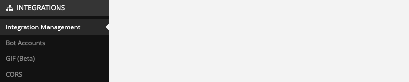
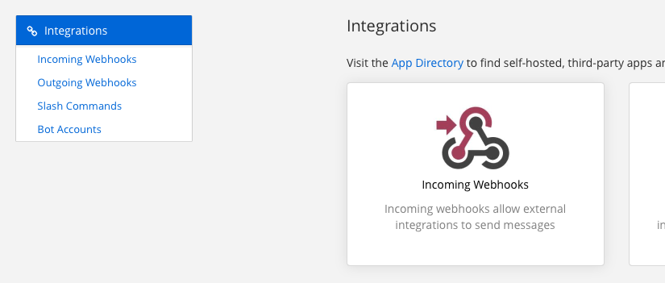
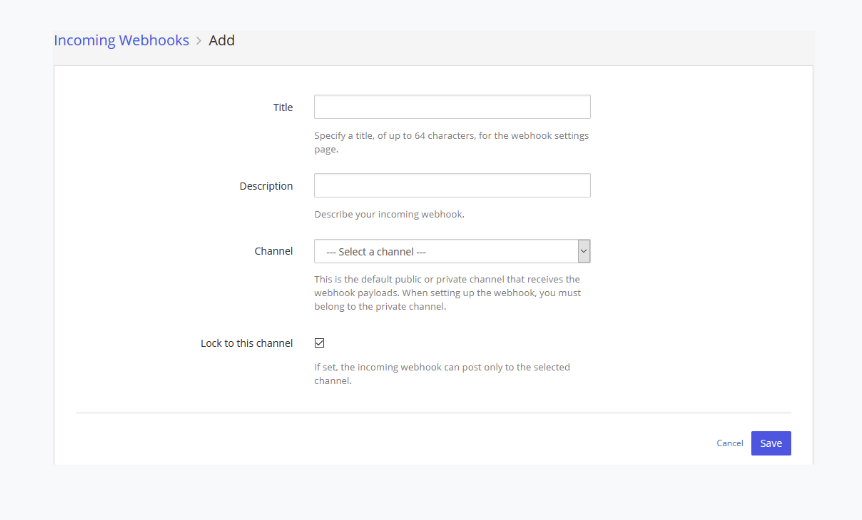

# Mattermost Integration

## Enable Incoming Webhooks, Custom Username and Profile Picture for Webhooks

1. Make sure you are logged as a system admin account in your Mattermost server.
2. You need to check if your Mattermost installation can receive incoming webhooks and set custom username and profile picture for webhooks. 
   1. Go to the "System Console" --> "Integrations" --> "Integration Management".
   
   
   
   2. Check if the parameters "Enable incoming Webhooks", "Enable integrations to override usernames" and "Enable integrations to override profile picture icons" are set to true (if not set them to true).

   

## Set a Webhook in Mattermost

1. Make sure you are logged as a system admin account in your Mattermost server.
2. Go to the "Integrations" --> "Incoming Webhooks" --> "Add incoming Webhook" section.

   

3. Create the incoming webhook :

   

* **Title**: Kitsu
* **Description**: Kitsu
* **Channel**: You can create a channel or use any of existing ones because the message will be sent to a given user. 
* **Lock to this channel**: It must be set to False.
* **Username**: kitsu / Not important it will be overridden by Kitsu.
* **Profile Picture**: Not important it will be overridden by Kitsu.

4. After clicking on "save", Mattermost proposes you a new URL that you must copy.

5. Copy that URL in the "Settings" of Kitsu and in the text field "Mattermost Webhooks (optional)" and after click on "Save settings".

   

> **_Note:_** The users who wants to have notifications enabled have to be the same Mattermost server than the one you use in these steps.

## Enable Notifications

Each user can set in their profiles the notification push to
Discord. They have to switch the "Discord notifications enabled" 
field to "Yes" and enter their "Mattermost username".

You're done!