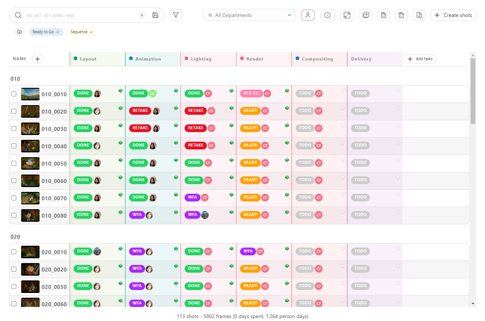
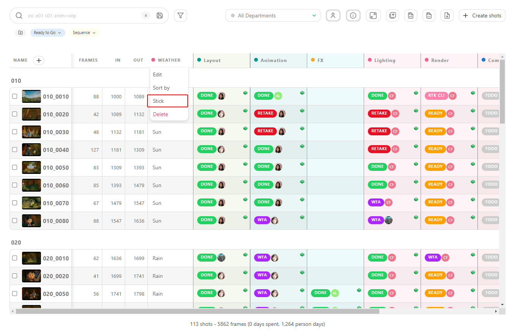
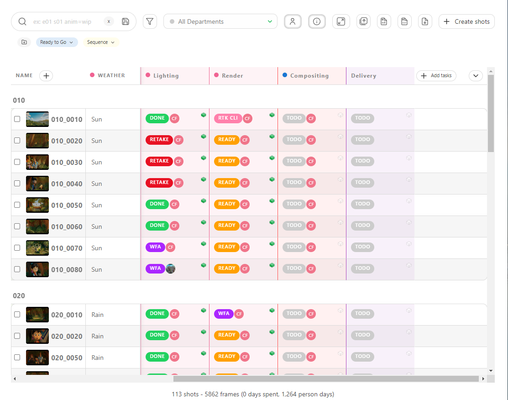

# Meta Columns

## Create Metadata Columns

To add more information on the general spreadsheet pages, you can create a **Metadata Column**.

You may have extra information to add to your pages, such as the **level of difficulties**, **Weather**, **Tag**, etc. You can store all text (or number) information in the custom metadata column.

Click on the **+** near the Name column.

With the **Type** option, you can choose how you want to store your information:
- a free **Text**: you can type different elements on each entity 
- a **Number**: add only numbers  
- a **Checkbox**: add a single checkbox
- a **List of value**: select an unique element from a list
- a **List of tags**: select several elements from a list
- a **Checklist**: create a list of checklist

::: warning 
The **Text**and **Number**allow you to add different information for each entity. You don't have to plan it first.

The **List of value**, **List of tags**, and **Checklist** give you the same choice for each entity. Moreover, it has to be filled now.

Type the list elements below **Available values**, and confirm them by clicking on **Add value**.
:::

You can also link the **metadata column** to one or several **departments**.

::: tip
Link a metadata column to a department. The artists/supervisors will see it on their to-do page and in the department-filtered view.
To create more departement see [Create Departments](../configure-kitsu/README.md#create-departments)

You can link the metadata column to one or more departments. Click on the department from the list and then click on **add** to be effective.

Here, the VFX column is linked to two departments.

:::

::: details Edit meta column
On the global page of the asset or the shot, click on the arrow on the direct right of your metadata column and click on **Edit**.

:::

You can fill in this information directly on the global spreadsheets page.
The cases are editable.

::: tip
You can batch-modify the metadata column by selecting several entities on the left and then modifying your metadata column.

:::

::: details Edit by hand
You can also modify the information with the edit button .

You now see a new line on the edit pop-up. You can select the information from the list,
alternatively, enter the free text or number, check a box, or use the checklist, depending on your previous choice.

Remember to press the **Confirm** button when you are done.

:::

Go to the general spreadsheet page if you need to edit or delete the metadata column.
Nearby the name of your metadata column, click on the arrow .

::: tip
You can **sort** your global page with this new column. Click the arrow on the right of the column name to open his menu. Then click on **Sort By**.

You can also **Stick** the metadata column to the left.
:::

## Display or Hide all Metadata Columns

You can hide all the non-essential columns, like **Description**, **Metadata column**.

Just click on the **Hide Additional Information**
 button on the top right of the page.

 

To make the information reappear, click on the same button,
 it won't have the grey highlight.

 

## Display or Hide one Metada Column

You may need to hide or display a specific  **Metada Column** on a global page. 

To hide your metadata column, click on the arrow on the right border of the global page.

You can choose which column you want to **hide** or **display**.

## Sticky Columns

If a piece of information is very important to you, you can **Stick** this column next to the shot name.

Click on the arrow on the right of the column to open the column menu, then choose **Stick**.

