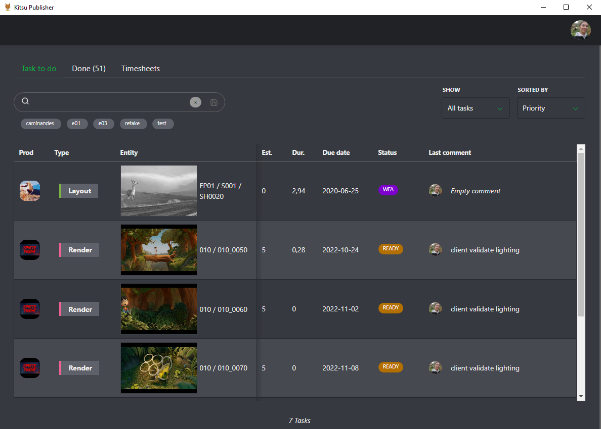
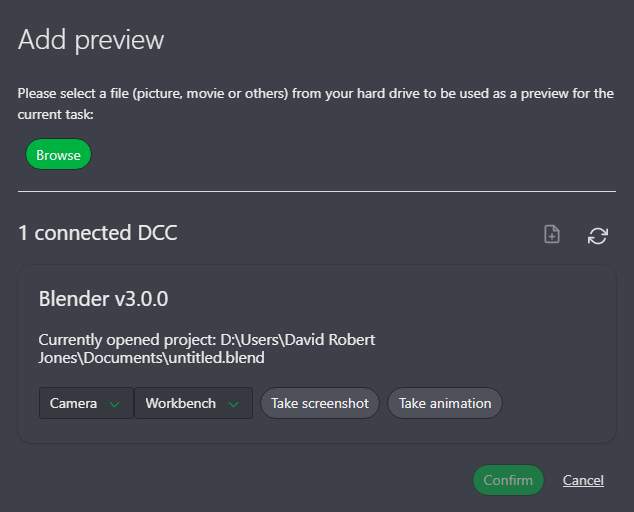
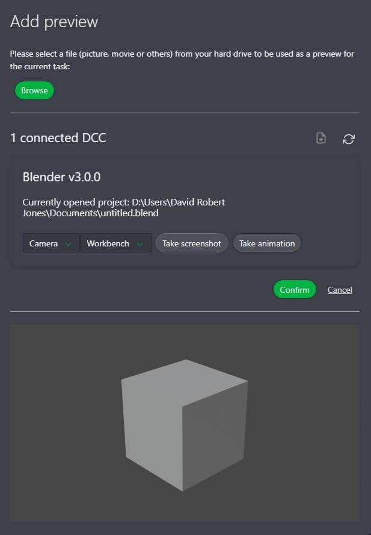
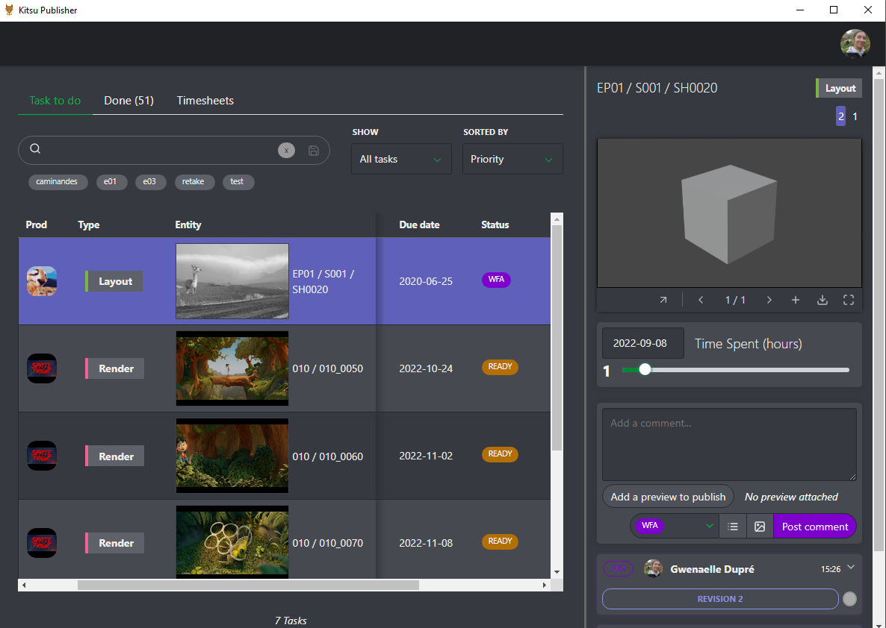
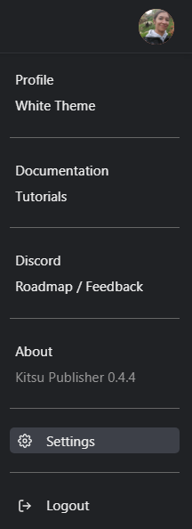

# Kitsu Publisher

Kitsu is a web application designed to streamline production progress sharing and delivery validation, enhancing communication among stakeholders for faster, higher-quality outputs. 

The Kitsu Publisher is a desktop application that bridges DCC tools with Kitsu, allowing artists to manage their tasks, add comments, and send previews directly from their tools.

## DCC Integrations Status:

Currently supported:
- Blender
- Toon Boom Harmony
- Unreal Engine

Work in progress:
- Photoshop
- Nuke

## Installation

### Installation of the Kitsu Publisher

#### Pre-Requisites

You need to download (or to build if you want to: see [Development Environment](#development-environment)) your preferred installer/package/portable for the app corresponding to your OS in the [releases](https://github.com/cgwire/kitsu-publisher-next/releases/latest).

All commands have the keyword {version} in the filenames, you need to replace the version with the current version of the Kitsu Publisher.

#### On Linux

- **deb package** (for Debian-based distributions):
  - To install the package:

    ```shell
    dpkg -i kitsu-publisher_{version}_amd64.deb
    ```

  - The package is now in your applications and in your $PATH.

- **rpm package** (for RHEL-based distributions):
  - To install the package:

    ```shell
    rpm -i kitsu-publisher_{version}_x86_64.rpm
    ```

  - The package is now in your applications and in your $PATH.

- **snap package**:
  - To install the package:

    ```shell
    snap install kitsu-publisher_{version}_amd64.snap --dangerous
    ```

  - The package is now in your applications and in your $PATH.

- **tar.gz archive**:
  - To extract the archive:

    ```shell
    tar -xf kitsu-publisher-{version}.tar.gz
    ```

  - To run the app:

    ```shell
    kitsu-publisher-{version}/kitsu-publisher
    ```

- **AppImage**:
  - to run the app:

    ```shell
    ./Kitsu publisher-{version}.AppImage
    ```


#### On Windows

- **NSIS Installer**:
  Double-click the installer `Kitsu-publisher-Setup-{version}.exe` and follow the instructions.

- **MSI Installer**:
  Double-click the installer `Kitsu-publisher-{version}-ia32.msi` to install the app.

- **Portable application**:
  Double-click the executable `Kitsu-publisher-{version}.exe`.

- **Zip portable application**:
  Extract the zip `Kitsu-publisher-{version}-ia32-win.zip`, and double-click `Kitsu publisher.exe`.

#### On MacOS

- **DMG Installer**:
  Double-click the installer `Kitsu-publisher-{version}.dmg`, drag the Kitsu logo to the "Applications" folder.

- **PKG Installer**:
  ```shell
  sudo installer -package Kitsu-publisher-{version}.pkg -target /
  ```

- **Zip portable application**:
  Double-click the zip `Kitsu-publisher-{version}-mac.zip`, then double-click the Kitsu Publisher icon.


## Development Environment

### Pre-Requisites

To develop or to build the Electron app you need [Node.js](https://nodejs.org/en/)>=16.11 installed.

### Dependencies

To install all the dependencies needed by the Electron app you have to run in the project folder:

```shell
npm install
```

### Run

To run the Electron app in development mode you have to run an npm script:

```shell
npm run dev
```

It will spawn an electron instance and a Vite development server.

### Build the Electron App

#### Pre-Requisites

- On debian based Linux you need:

  - To install these packages:

    ```shell
    apt-get install build-essential libcairo2-dev libpango1.0-dev \
    libjpeg-dev libgif-dev librsvg2-dev
    ```

  - If you want to build specific target like rpm you need to install:

    ```shell
    apt-get install rpm
    ```

- On Windows you need:

  - See the [wiki](https://github.com/Automattic/node-canvas/wiki/Installation:-Windows) of node-canvas.

- On macOS you need (with [Homebrew](https://brew.sh/)):

  ```shell
  brew install pkg-config cairo pango libpng jpeg giflib librsvg
  ```

#### Building the App

You need to run npm scripts:

- If you only want to build an unpackaged directory:

  ```shell
  npm run build
  ```

- If you want to build for all targets:

  ```shell
  npm run build:all
  ```

## Installation of the DCCs connectors

#### Pre-requisites

Download the `connectors-{version}.zip` from the [latest releases](https://github.com/cgwire/kitsu-publisher-next/releases/latest) and unzip it.

#### Blender (version>2.80)

- You need to go inside the connectors/blender directory.

- On Windows (with PowerShell):

  - If you want to be guided through the installation of the plugin, you have to right-click on the script install.ps1 and select "Run with PowerShell" to run the script in prompt mode. If you have multiple installations from installer of Blender it will install the plugin for all the installations (not if you select a portable Blender).

  - If you want to run the script with PowerShell command line it's possible, look at the help with:

    ```shell
    .\install.ps1 -help
    ```

- On Linux:

  - If Blender is installed with a system package (for example: deb or rpm):

    ```shell
    bash ./install.sh --system
    ```

  - If Blender is an unpacked directory (tar.xz archive):

    ```shell
    bash ./install.sh --unpacked-directory=PATH_TO_YOUR_PORTABLE_BLENDER
    ```

  - If Blender is installed with a snap package:

    ```shell
    bash ./install.sh --snap
    ```

- On macOS:

  - If Blender is installed with a dmg image or Homebrew:

    ```shell
    bash ./install.sh --dmg
    ```

#### Toon Boom Harmony

- You need to go inside the connectors/harmony directory.

- On Windows (with PowerShell):

  - If you want to be guided through the installation of the plugin, you have to right-click on the script install.ps1 and select "Run with PowerShell" to run the script in prompt mode. If you have multiple installations from installer of Toon Boom Harmony it will install the plugin for all the installations.

  - If you want to run the script with PowerShell command line it's possible, look at the help with:

    ```shell
    .\install.ps1 -help
    ```

- On macOS:

  - coming soon

#### Unreal Editor (version>=5)

- You need to go inside the connectors/unreal directory.

- On Windows (with PowerShell):

  - If you want to be guided through the installation of the plugin, you have to right-click on the script install.ps1 and select "Run with PowerShell" to run the script in prompt mode. If you have multiple installations from installer of Unreal Editor it will install the plugin for all the installations.

  - If you want to run the script with PowerShell command line it's possible, look at the help with:

    ```shell
    .\install.ps1 -help
    ```

- On Linux:

  - coming soon

- On macOS:

  - coming soon

## Publishing Previews with the Kitsu Publisher

You must first have the Kitsu publisher and the plugin installed on your computer.

## Consult Your To-Do List

Log in to the Kitsu Publisher using your Kitsu credentials. You will see your to-do list with similar options as in Kitsu.



To comment or publish on a task, click on the status.


The comment panel will open with the previews and the whole history of this task.

The first new element is that you have direct access to your timesheet. You can move the cursor to adapt the timeline to the number of hours spent on this specific task.


When you are ready to publish your work, click on the **Add a review to publish** button.


## Publish a Preview From the Publisher

You can either upload the preview manually or let the Kitsu Publisher do it for you. Kitsu Publisher will detect the open DCC and project.



Select your camera and render engine, and choose between a screenshot or full animation render.

Here, for example, we select the **Screenshot** option. Kitsu publisher will ask your DCC to do the render for you and display the result.



Once satisfied, click **Confirm**, add your comment, change the status, and click **Post Comment** to upload the preview.



Now everybody logged in to Kitsu will see your comment and publish.


## Setup the Publisher

### Change the Save Directory and Add Scripts

You can access settings via your avatar.



You have two options here: the first one is the directory for exports made by the DCCs.

Per default, it's set to your temporary directory. You can change it, and then this specific folder will be used for all the exports. You can also use a network drive.

The second option is about the command you can launch after the exports made by the DCCs but before the upload into Kitsu.

You can launch a command or a script directly on the exported file, the folder, etc.


You can insert variables in your command. You just have to put the chosen variable under curly brackets (for example: {exportFile}). These variables are also in the environment variables at runtime. They are listed below:

- exportsDirectory (String) : the directory path where the exports are made.
- exportFile (String): the path of the file that will be exported.
- exportIsAnimation (Boolean) : true if the export is an animation else false.
- exportIsScreenshot (Boolean) : true if the export is a screenshot else false.
- DCCName (String) : the name of the DCC.
- DCCVersion (String) : the version of the DCC.
- currentProject (String) : the path of the current project opened in the DCC.
- cameraSelected (String) : the name of the Camera selected.
- rendererSelected (String) : the name of the renderer selected.
- extensionSelected (String) : the name of the extension selected.
- entityName (String) : the name of the entity.
- entityTypeName (String) : the name of the entity type.
- episodeName (String) : the name of the episode type.
- fullEntityName (String) : the full name of the entity.
- projectName (String) : the name of the project.
- taskStatusName (String) : the name of the task status.
- taskTypeName (String) : the name of the task type

### View the Result of the Setting on the Export Pop-Up

Once your preview is rendered, you can check the directory and the scripts launched.


Click on the options icon to see the command executed before the import.


Confirm if everything is correct, then post your comment as usual.
