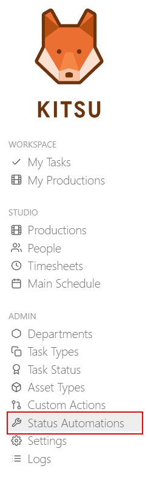
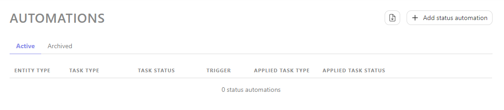
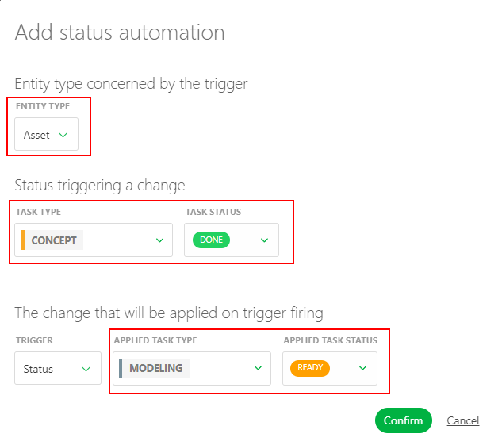
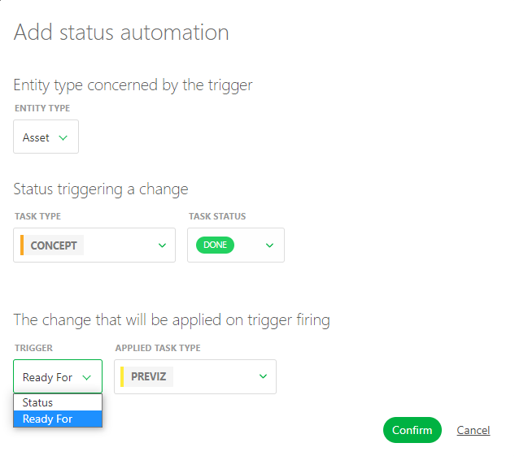
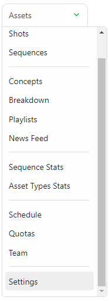
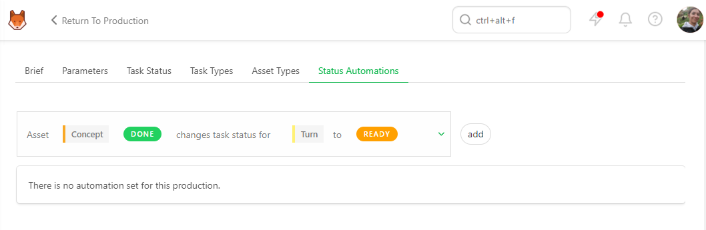
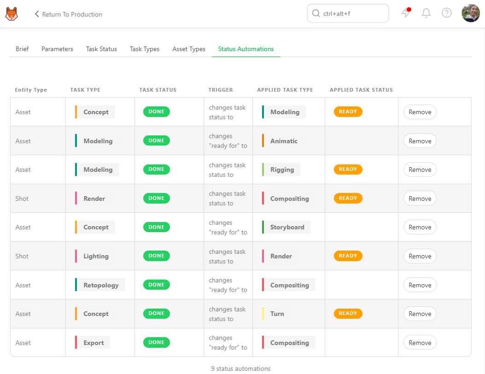

## Automation

### Create a New Status Automation

A **Status Automation** defines rules or conditions that automatically trigger changes in the status of tasks based on predefined criteria. You can set up **Status Automation** for both asset and shot tasks.

For assets, you can establish **Status Automations** between tasks. For example, when the concept task status is set to `done`, the downstream modelling task status is automatically changed to `ready`.

Additionally, you can create **Status Automations** that update the **Asset Status** based on task statuses. For example, when the concept task is set to `done` , then the linked asset status is set to ``layout``.

::: tip
You can also ask Kitsu to **copy the latest preview** with the Automation.
:::

Go to the main menu   and select **Automation**.

From this page, you can create **Status Automations** by clicking the **+Add status automation** button.

You have the option to create **Status Automation** for either the **asset** or the **shot**.

Next, you can select the **task type** and the **status** that will trigger the Automation.

You can specify which **Task Type** will respond to the Automation and select the **Status** that will be changed.

You need to change the trigger from "Status" to **Ready For** in order to initiate the change in **Ready For** status.

You will notice the **Applied Task Type** will now display **Shot task type**.

To create a **Status Automation** for shots, you must change the **Entity Type** to shots.

Your new **Status Automation** is now created in your **Global Library**.

::: warning
You must add status automations to your **Production Library** once you have created your production.
:::

::: tip
At any point during the production, you can return here and create more **Status Automations** if needed, and then add them to your production.
:::

### Configuring Status Automation for a Production

On the **Navigation Menu**, choose on the dropdown menu the **Setting**.

Per default, Kitsu will load no **status automation** of your 
status automation **Global Library** into your **Production Library**.

But you can use only specific **Status Automation**, depending on your production type.

On the **Status Automation** tab, you can choose which automation you want to use on this production, 
validate your choice with the **add** button.

