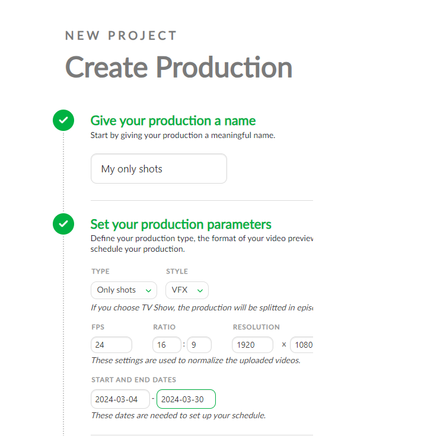
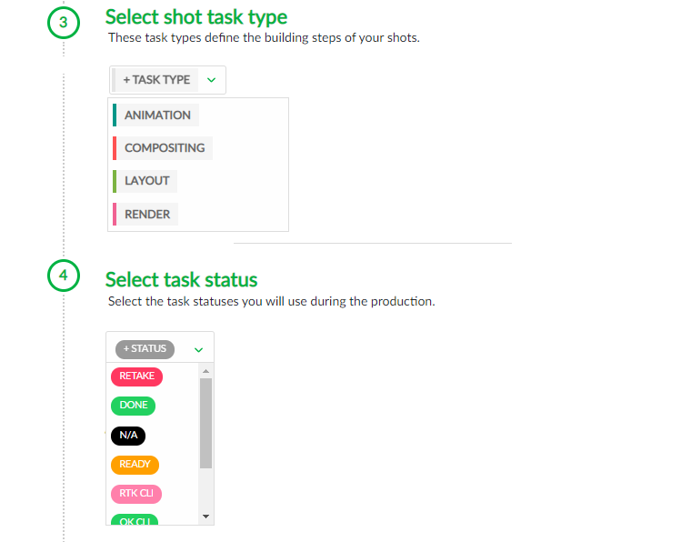
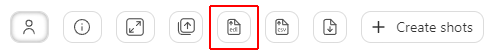
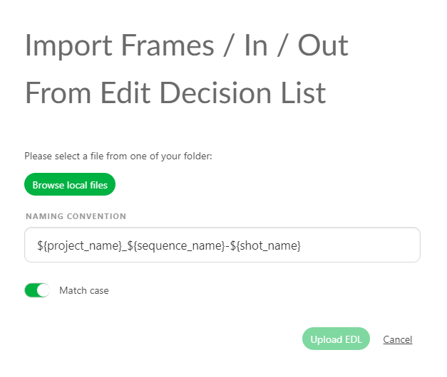
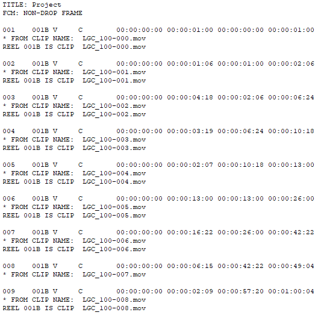
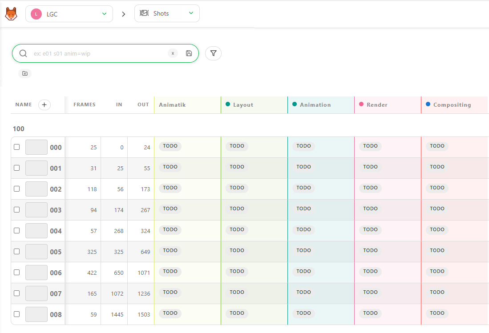
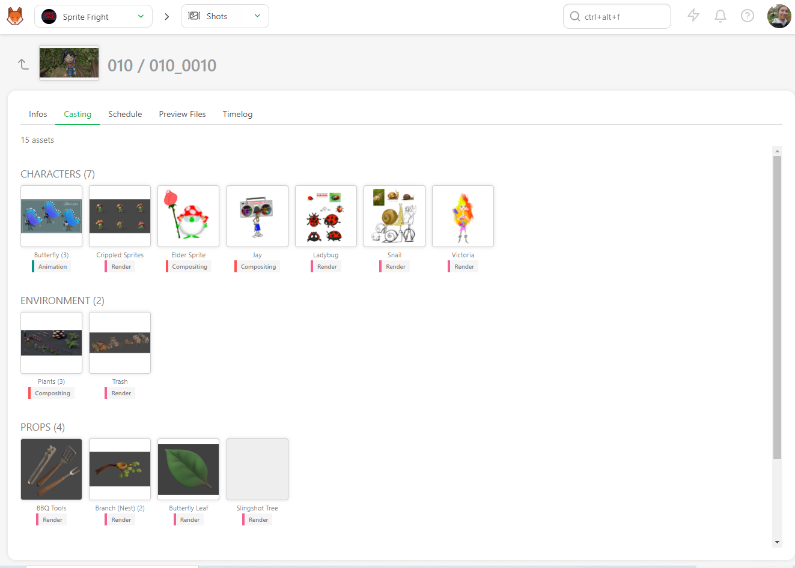
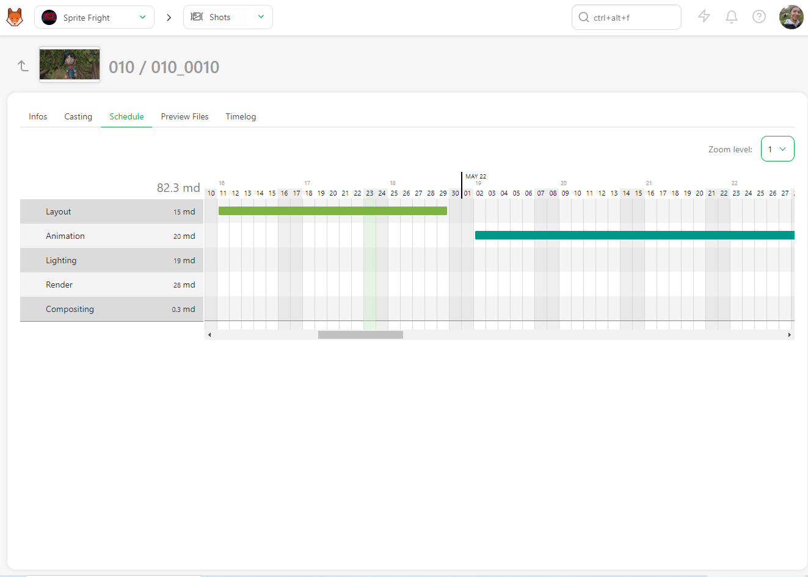
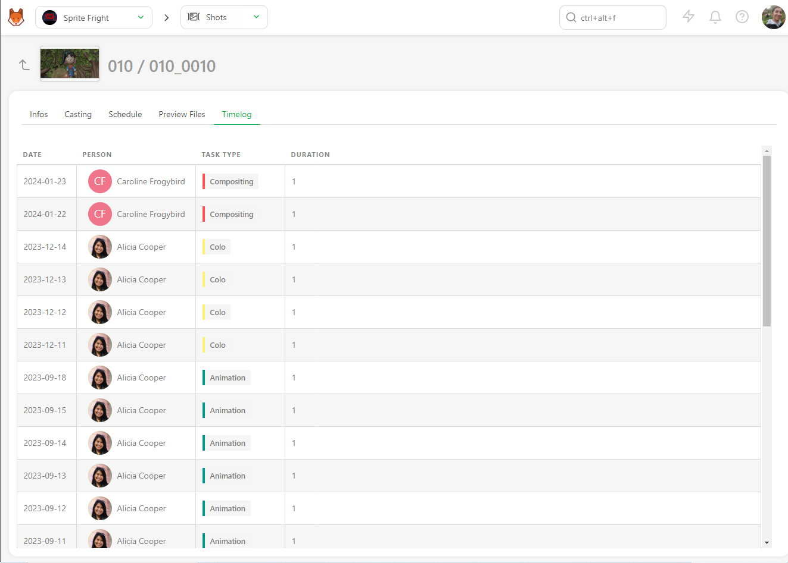

# Create a SHOTS only Production

Now that you have designed your workflow in Kitsu, and invite more people, it's time to create your production. 

Click on the **Create a new
production** button.

Enter your production name, and choose **only shots** as the **type**, then select the style that fit the most your production.

Then, you have to fill in technical information, such as the number of FPS, the Ration, and the Resolution.

All these data will be used when Kitsu re-encodes the video previews uploaded.

Then, you need to define your production's start and end dates.

You need to select your shots workflow (Task Type) (3) and you validation process (Task Status) (4), 

::: tip
To create your **Production Workflow**, you will select Task Types from the Global Library.

If you realize you missed some Task Types, you will be able to create them later.

See the [Studio Workflow](../first_production/README_configure_Kitsu.md#studio-workflow) section.
:::

Then, 5 is the option parts. If you already have a spreadsheet with your shot.

See the **import CSV** section for more details.

[Import shot](../batch-action/README.md#create-shots-from-a-csv-spreadsheet-file)

Validate everything with the  button.

## Introduction to Kitsu global Page

Welcome to the global asset page of Kitsu.

Let's take a look around.

On the top part (1), you have the **global navigation**, which is always visible throughout all the production pages.

**From left to right:**

### Main Menu

By clicking on the top left button, Kitsu , (or you Studio logo) you will open the **Main Menu**.

On the **Main Menu** you will find direct acces to your assigned tasks, the productions, global and team schedules,  the workflow customization page and the Kitsu settings.

::: details Main Menu Details
**WORKSPACE**
- My Tasks: your assigned tasks 
- My Checks: All the tasks with status **Is Feedback Request** depending on your departement(s)
- My Productions: get back to the selection of the production page.

**STUDIO**
- Productions
- People
- Timesheets
- Main Schedule
- Team Schedule
- All tasks
- News Feed
- Entity Search

**ADMIN**
- Departments
- Task Types
- Asset Types
- Custom Actions
- Automations
- 3D Backgrounds
- Bots
- Settings
- Logs

::: warning Permission Visibility
The WORKSPACE section is enable for all the permissions, except the **My Checks** which is not seen by artists.

Artist (and above) can also see their own **Timesheets**, and have access to the **Entity Search**
:::

### Navigation

On the right if the main menu icon, you have the navigation dropdown menu.

You can choose between production. The name of the actual production and actual page are always displayed.

You can use the dropdown menu to navigate from production to production (if you have several).

Once you have selected a production, the next dropdown menu is here to help you navigate through the different pages of this production.

::: details Navigation details
The first section is about the tracking of your tasks
- Shots
- Sequence
- Edits (If you have created specific tasks)

The second section if more about the side of the production
- Concepts
- Playlists
- News feed

Third section is about statistics
- Sequence Stats

Fourth section is related to Team Management
- Schedule
- Quotas
- Team

And the fifth section is about the settings of your production
- Settings

::: tip
You start with the asset page, but you can change your production homepage to other entities (see setting page)
:::

::: warning 
If you realized you need an extra level of navigation as **Episodes**, You need to change your production Type as a **TV Show**.

If on the contrary, you realize you need the **assets** and not **Only Shots**, you need to switch your production type from **Only Shots** to **Short**.
:::

### Global Search, News, Notification and Documentation
On the right of the navigation dropdown menu, you have the global search. It's a quick access search that will display the 4 first result. If you need more results, and more filtering option see the **Entity Search** page.

The next icon  is a direct link to our news and feedback page. 

You can see all the new features with an animated gif, and also add suggestion about the next feature you want to see in Kitsu.

Then, the bell shows you your notification (assignation, comments, tag). The number of notification unread will appear in the bell icon.

The last icon before your avatar is the documentation button.
, that you are reading right now!

### Personal Settings
You can click on your avatar to open your menu (setting, documentation, etc.).

.

## The Tasks Spreadsheet

### Entitie spreadsheet

The second part of the screen is common to all the entities (asset, shot, sequence, edit). This is the global tasks spreadhseet.

Here you see the status, assignation, priority etc for each tasks.

::: tip
The first lign and column header of the spreadsheet always stick to the top of the page, even if you scroll down.

You can also **Stick** other columns to keep them visible at all time
:::

### Filters

The first element on the left is the filter box. You can type anything you want for simple filtering, sequence, asset type, etc.

If you need more advanced filtering, please use the filter builder button.

You can then save all the filters and use them as your pages.

### Simplify the display

On the right part of the screen, there are some buttons (from left to right) to hide or display the assignation, hide or display the extra column, enlarge or reduce the thumbnail,

### Import / Export
batch import thumbnail , and finally import  or export  data.

### Metadata column
Below, you have the name of the column. the (+) next to **Name**  is here to create a new metadata column. Then, you have the name of the task type column.

### Customize the view
On the far right of the screen, next to the scroll bar, is the option to hide and display a text column

.

### Sum-up of your view
The last part (4), at the bottom of the screen, is the sum-up of your displayed page. It means the sum-up will update if you filter the page.

You can see the number of elements (assets or shots), the total number of estimated days, and the total number of already spent days.

## Create a Shot
### Create your first shot

It's time to create **shots** for your production.

::: warning
Shots are linked to Sequences in Kitsu.
Meaning you need to first create a sequence, then populate this sequence with shots.
:::

You need to go to the **Shots** page: you can use the
dropdown menu and click on the **SHOTS**.

Click on the **Add shots** button to start with the shot creation.

::: warning
When you create a shot, the task workflow you have designed will be applied and all the tasks will be created at the same time than the shot.
:::

A new pop-up opens for the creation of the shots.
You can now create the sequences and the shots.

Enter the first sequence, for instance, sq01,
then **add**. 

Now you can see your sequence created. To add shots to this sequence, you need to select it, and create your shots.

For example type sh0010 on the shots column, then again **add**.
You can also define padding for your shots.

::: tip
If you want to name your shots 10 on 10 as SH0010, SH0020, SH0030 etc, set the **Shot Padding** as 10
:::

You can now see that new shots are listed, linked by their sequence.
You have created the first shot of the first sequence.

Now, let's add more shots than just one! As you can see, the box already contains your name
code but incremented, so you have to continue to click on **add** to
create more shots.

To add more sequence, you need to go to the left part, and type the name of your new sequence, then click on **add**.
Your second sequence is selected, you can now add shots.

::: tip
If a shot is misplaced on a sequence, you have to edit the shot
, and change the
sequence.

:::

To delete a shot, see the FAQ : [How to delete a shot](../faq-deletion/README.md#how-to-delete-a-shot)

To delete a sequence, see the FAQ : [How to delete a Sequence](../faq-deletion/README.md#how-to-delete-a-sequence)

## Create Shots form an EDL File
You may already have your shots list ready in an **EDL** file.
With Kitsu, you can import directly your **EDL** file to create the sequence, shot, number of frame, frame in and frame out.

On the **Global Shot Page** you have an **Import EDL** button.

On the pop-up you can select the naming convention of the video file used during the editing.

It means the video clip on the editing is named as project_sequence_shot.extension.

Here is an example of an EDL for the LGC production.

The video files are named  LGC_100-000.mov, it means LGC is the production name, 100 is the sequence name, and 000 is the shot name.

Once you are set with the naming convention, you can import the edl file.

Then click on **Upload EDL**

Then Kitsu will create the shots.

:::

::: details Create Shots from a CSV Spreadsheet File
You may already have your shots list ready in a spreadsheet file.
With Kitsu, you have two ways to import them; the first is to import a `.csv` file directly, the second is to copy-paste your data directly into Kitsu.

First, save your spreadsheet as a `.csv` file.

Then, go back to the shot page on Kitsu, and click on the **Import** icon.

A pop-up window **Import data from a CSV** opens, click on **Browse** to pick your `.csv` file.

To see the result, click on the **Preview** button.
  
You can check and adjust the name of the columns with the preview of your data.
 
NB: the **Episode** column is only mandatory for a **TV Show** production.
 

Once everything is good, click on the **Confirm** button to import your data into Kitsu.

Now, you have all your shots imported into Kitsu, and the task created according to your **Settings**.

:::

::: details Create Shots by Copy / Pasting a Spreadsheet File
Open your spreadsheet, select your data and copy them.

Then, go back to the shot page on Kitsu, and click on the **Import** icon 
.

A pop-up window **Import data from a CSV** opens, click on the **Paste a CSV data** tab.

 
You can paste your previously selected data and see the result with the **Preview** button.
 

  
You can check and adjust the name of the columns with the preview of your data.
 
NB: the **Episode** column is only mandatory for a **TV Show** production.
 

Once everything is good, click on the **Confirm** button to import your data into Kitsu.

Now, you have all your shots imported into Kitsu, and the task created according to your **Settings**.

:::

### See the Details of a Shot

If you want to see the details of a shot, click on its name.

A new page opens with the list of the tasks, the assignation, and the status newsfeed on the right.
You can navigate through each by clicking on the name of the tabs.

You can click on the status of each task to open the comment panel and see the history of the comments and the different versions.

You can also access the **Casting**, 

The **Schedule** if you have previously filled the task type page data. If the data are already first filled, then you will be able to modify them directly here. 

the **Preview Files** uploaded at various task types, 

And the **Timelog** if people have filled out their timesheet on the tasks of this asset.

## Add more tasks after creating the shots
If you realize after creating the shots that task are missing, you can still add them.

First be sure that the missing task type is added in the setting page under the task type tab.

Then go back to the shot page and click on + Add tasks

### Update your shots

At any point you can update your shots, change their name, sequence, modify their description and any custom information you added to the global page.

You can edit shots by going to the shot page, hovering over the shot you want to modify, and then clicking on the **edit** button
 (1) on the right side of the line.

To extend the description on the main shot page, click on the first words (2), and a pop-up opens with the full description.

::: details Update Shots Information with CSV Import
You can use the **CSV Import** to update your data as the **NB Frames**, **Frame IN**, **Frame Out** or any custom **Metadata column**.

You can update the **Assignation**, the **Status** of tasks and add a **Comment**.

Open your spreadsheet, select your data and copy them.

Then, go back to the shot page on Kitsu, and click on the **Import** icon 
.

A pop-up window **Import data from a CSV** opens, click on the **Paste a CSV data** tab.

 
You can paste your previously selected data and see the result with the **Preview** button.
 

  
You need to switch on the **Option: Update existing data**.
the updated shots will be in blue

 
NB: the **Episode** column is only mandatory for a **TV Show** production.
 

Once everything is good, click on the **Confirm** button to import your data into Kitsu.

Now, you have all your shots imported into Kitsu, and the task created according to your **Settings**.

:::

## Add the number of Frame and frameranges to the shots

At this stage of the production, the animatic should be done. This means you have
the length (**number of frames**, **frame range In**, and **frame range Out**) for each shot. You can
add this information to the spreadsheet. This way, you are sure that all
the frames are calculated and none are missing or over-computed.

::: warning
If you have created your shots and sequence by hand, 
the **Frame** column will be hidden. You need to edit at least one shot and fill the number of frame to display the **Frame** columnn.
If you have created your shots and import the number of frames with a csv/spreadsheet, the column will be displayed.
:::

You need to edit the shots to fill in the frame range information. Click on the
edit button  on the right
side of the shot line.

You can enter the shots **In** and **Out** on the new window. Then, save with the **Confirm** button.

Now, the frame range appears on the general spreadsheet of the shot page.

Now that you have unlocked the **Frames**, **In**, and **Out** columns, you can fill them
directly from the global shot page.

Click on the case you want to fill in and add the data.

::: tip
If you enter the **Frame In** and **Frame Out**, Kitsu will automatically calculate the **Number of Frame**.
:::

You can also use the **CSV Import** to update your frame range quickly.
 [Update Shots information with CSV Import](../batch-action/README.md#update-shots-information-with-csv-import)

You can have access to the shot values history, too.

## Create Custom Metadata Columns

To add more information on the general spreadsheet pages, you must create a custom **metadata column**.

You may have extra information to add on your pages as the **level of difficulties**, **Weather**, **Tag**, etc. You can store all kinds of text (or number) information in the custom metadata column

Click on the **+** near the Name column.

With the **Type** option you can choose how you want to store your information:
- a free **Text**, 
- a **Number**, 
- a **Checkbox**, 
- a **List of value**,
- a **List of tags**,
- a **Checklist**.

::: warning 
The **Text**, **Number**, and **Checkbox** allow you to add different information for each entity. You don't have to planned it first.

The **List of value**, **List of tags** and **Checklist** give you the same choice for each entity. Moreover, it has to be filled now.

Type the list elements below **Available values**, and confirm them by clicking on **Add value**.
:::

You can also link the **metadata column** to one or several **departments**.

::: tip
If you link a metadata column to a department, the artists/supervisors will see it on their to-do page and department-filtered view.

You can link the metadata column to one or more departments. Click on the department from the list and then click on **add** to be effective.

Here VFX column is linked to two departements.

:::

::: details Edit meta column
On the global page of the asset or the shot, click on the arrow on the direct right of your metadata column, and click on **Edit**.

:::

Back on the global spreadsheets page, you can fill in this information directly on the global page.
The cases are editable.

::: tip
You can batch modify the metadata column by selecting on the left several entities, and then modify your metadata column.
:::

::: details Edit by hand
You can also modify the information with the edit button .

You now see a new line on the edit pop-up. You can select the information from the list,
alternatively, enter the free text or number, check a box, or use the checklist, depending on your previous choice.

Remember to press the **Confirm** button when you are done.

:::

If you need to **edit** or **delete** the metadata column, go to the general spreadsheet page.
Nearby the name of your metadata column, click on the arrow .

::: tip
You can **sort** your global page with this new column. Click the arrow on the right of the column name to open his menu. Then click on **Sort By**.

You can also **Stick** the metadata column to the left
:::

## Create a Sequence

In Kitsu, you can also track tasks at the **Sequence** Level.
It's especially useful when
you have macro tasks to track, like Story and color Board, Color Grading, etc.

Use the navigation menu to go to the **Sequences** page.

::: warning
This new page behaves like the asset and shot global page.

To use this page, You first need to create dedicated task types on your **Global Library**
 with the **Sequence** attribute.

See **Pipeline customization** Section to create a new **Task Type**.

[Pipeline customization](../customization-pipeline/README.md)

Once you have created your **Task Types**  on your **Global Library**, add them to your
**Production Library** (setting page).
:::

Once your have your task types ready in the setting page, you need then to create a sequence (same as the assets or shots).

This new page behaves like the asset and shot global page. You can add your edits with the **+ New sequence** button.

You can assign tasks, do the review, change status etc.

You can add a metadata column, fill in the description, etc.

::: tip
You can create a sequence directly from here (+New sequence button), or you can create a sequence linked to your shots from the global shot page.
:::

You can **Rename** and **Delete** the Sequence entity on this page, as for the asset and shot entity.

If you click on the name of a sequence, you will see the detail page of this sequence.

On the detailed page, you have access to the casting of the sequence.
You can see all the assets used in the whole sequence.

You can also access the schedule, Preview Files, Activity, and Timelog of the sequence **tasks**.

## Create an Edit

You can track tasks at the **Edit** Level, in Kitsu.

It's especially useful when
you have several edits to track through several step of validation. For example you can track your whole movie and several trailers, and you track the First Edit, Fine edit, mix etc.

::: warning
Per default **Edit** page will not be displayed until you have task types for it on your **production library** (setting page)
:::

To use this page, you need to first create a dedicated task type on your **Global Library**
 with the **Edit** attribute.

See **Pipeline customization** Section to create a new **Task Type**.

[Pipeline customization](../customization-pipeline/README.md)

Once you have created your **Task Types**  on your **Global Library**, add them to your
**Production Library**, you will see the **Edit** displayed on the navigation drop-down menu.

This new page behaves like the asset and shot global page. You can add your edits with the **+ New edit** button.

You can assign tasks, do the review, change status etc.

You can add a metadata column, fill in the description, etc.

::: tip
You can also change the resolution per **Edit** depending on your deliveries.
:::

::: warning
The detail page is different from the other entities.

As **Edit** focus on a specific long video, the detail page looks more like the comment detail page
:::

You can **Rename** and **Delete** the Edit entity on this page as for the asset and shot entity.

