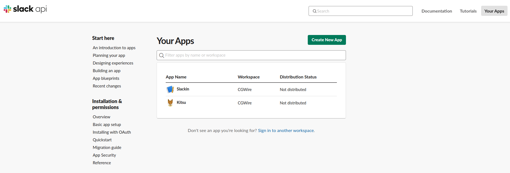
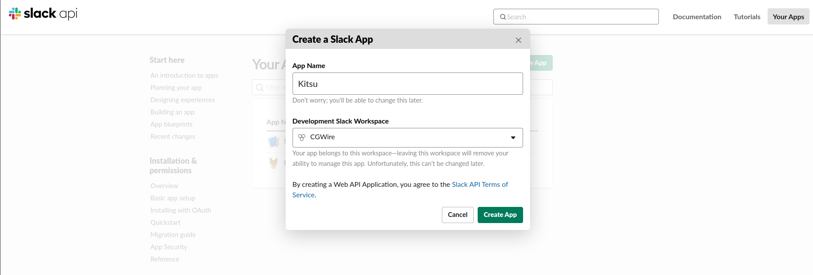
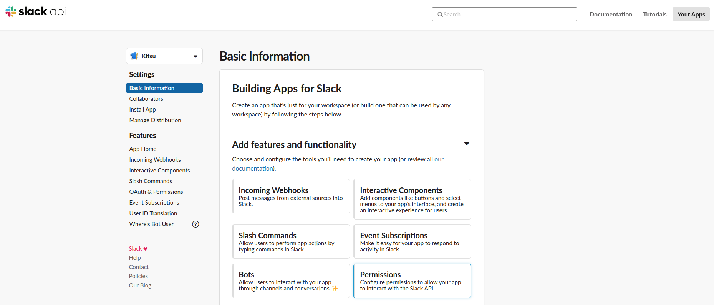
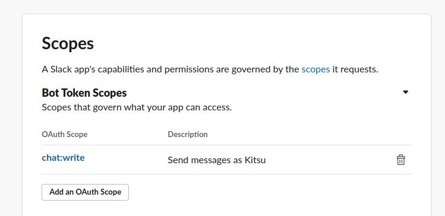
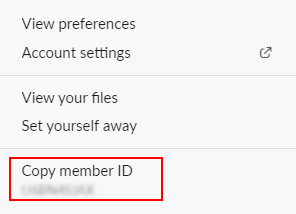

# Slack Integration

The Slack integration is tedious because it requires that you create a
dedicated application in your Slack space. But don't worry we explain the full
process in the following!

## Create a Kitsu application in Slack

### Create an application

To start with the integration, we need to create an application in Slack
dedicated to sending messages on your Kitsu instance behalf.

For that let's connect to [https://api.slack.com/apps](https://api.slack.com/apps)

From here click on the Create new App button:

Then enter Kitsu as name and chose the workspace you want to link with you Kitsu instance:

### Set the right permissions

When the app is created, go to the app page by clicking on its name in the list
and go to the *Basic information* section. Then click on the *Permissions*
button on the bottom right:

From there, go to the scopes section to add the required permission:

The required permission scope is `chat:write:bot`:

### Install App in your workspace

We can now proceed to the app installation in the workspace. Go to the
*Install App* section and proceed to installation by clicking on the big green
button:

Confirm the installation:

Your Kitsu Slack App is now up and running! You just need to link your Kitsu to your notifications sent to your Slack workspace.

### Get the token

Now come back to the *Install app* section. You should see the token to use to
link your Kitsu instance to Slack.

## Change Kitsu settings

### Link Kitsu to your new Slack application

Now that you have a valid token for your Slack application, go to the settings
page. There you can give the token to your Kitsu instance.

### Enable Slack notifications in your profile

The final step requires to go in your profile section. From there you can put
your Slack notifications on. It requires a last parameter: the Member ID you use
on your Slack.

You can find it in your Slack profile by clicking on More:

Then In your Kitsu profile, set the Slack notifications on and the Slack
nickname:

You can now enjoy pretty notifications right in your Slack workspace!

