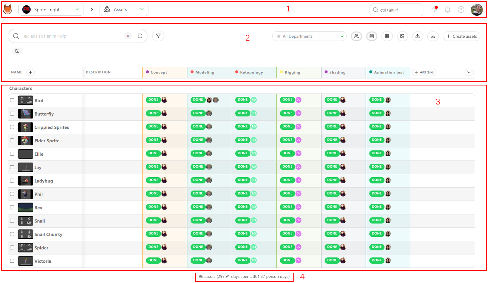
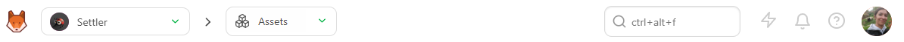
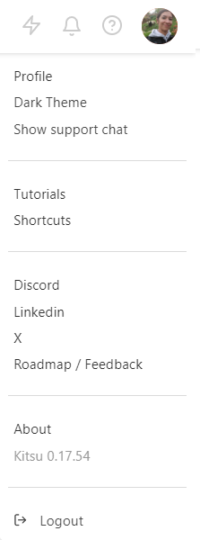
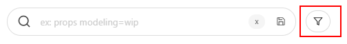
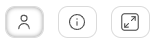
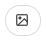
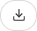
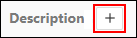
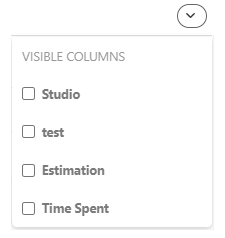

---
prev:
  text: 'Create a New Production'
  link: '/start-here/new-production'
next:
  text: 'Preparing Your Team'
  link: '/start-here/team-preparation'
---

# Main UI Concepts

## Introduction to the Kitsu Global Page

Welcome to Kitsu's global asset page.

Let's take a look around.

On the top part (1), you have the **global navigation**, which is always visible throughout all the production pages.

**From left to right:**

## Main Menu

You will open the main menu by clicking on the top left button, Kitsu (or your Studio logo).

You will find direct access to your assigned tasks, productions, global and team schedules, the workflow customization page, and the Kitsu settings on the main menu.

::: details Main Menu Details
**WORKSPACE**
- My Tasks: your assigned tasks
- My Checks: All the tasks with status **Is Feedback Request** depending on your department(s)
- My Productions: Get back to the selection on the production page.

**STUDIO**
- Productions
- People
- Timesheets
- Main Schedule
- Team Schedule
- All tasks
- News Feed
- Entity Search

**ADMIN**
- Departments
- Task Types
- Asset Types
- Custom Actions
- Automation
- 3D Backgrounds
- Bots
- Settings
- Logs

::: warning Permission Visibility
The WORKSPACE section is enabled for all permissions except My Checks, which artists do not see.

Artist (and above) can also see their own **Timesheets**, and have access to the **Entity Search**
:::

## Navigation

You will see the navigation dropdown menu on the right of the main menu icon.

You can choose between production. The name of the actual production and actual page are always displayed.

You can use the dropdown menu to navigate from production to production (if you have several).

Once you have selected a production, the next dropdown menu will help you navigate through the different pages of this production.

::: details Navigation details
The first section is about the tracking of your tasks
- Assets
- Shots
- Sequence
- Edits (If you have created specific tasks)

The second section is more about the side of the production
- Concepts
- Breakdown
- Playlists
- News feed

The third section is about statistics
- Sequence Stats
- Asset Type Stats

The fourth section is related to Team Management
- Schedule
- Quotas
- Team

The fifth section is about the settings of your production
- Settings

::: tip
You start with the asset page, but you can change your production homepage to other entities (see setting page)
:::

::: warning
If you realize you need an extra level of navigation, such as Episodes, you need to change your production Type to a TV Show.

If, on the contrary, you realize you don't need the **assets** or the **shots**, you also need to switch your production type to **Only Assets** or **Only Shots**.
:::

## Global Search, News, Notification and Documentation

You have the global search on the right of the navigation dropdown menu. It's a quick access search that will display the four first results. If you need more results and filtering options, see the **Entity Search** page.

The next icon  is a direct link to our news and feedback page.

You can see all the new features with an animated gif and also add suggestions about the next feature you want to see in Kitsu.

Next, the bell icon  displays your notifications (assignments, comments, tags). The number of unread notifications will be shown on the bell icon. There are various filters to help you stay on top of updates and revisit important ones when needed. You can easily mark notifications as read or unread or quickly filter by watching/non-watching to focus on what matters most and declutter your feed.

The last icon before your avatar is the documentation button.
, that you are reading right now!

## Personal Settings

You can click on your avatar to open your menu (setting, documentation, etc.).

.

## The Tasks Spreadsheet

### Entity spreadsheet

The second part of the screen is common to all the entities (asset, shot, sequence, Edit). This is the global tasks spreadsheet.

Here, you see the status, assignation, priority, etc, for each task.

::: tip
The spreadsheet's first line and column header always appear at the top of the page, even if you scroll down.

You can also **Stick** other columns to keep them visible at all times.
:::

### Filters

The first element on the left is the filter box. You can type anything you want for simple filtering, sequence, asset type, etc.

If you need more advanced filtering, please use the filter builder button.

You can then save all the filters and use them as your pages.

### Simplify the display

On the right part of the screen, there are some buttons (from left to right) to hide or display the assignation, hide or display the extra column, enlarge or reduce the thumbnail,

### Import / Export
batch import thumbnail , and finally import  or export  data.

### Metadata column

Below, you have the name of the column. the (+) next to **Name**  is here to create a new metadata column. Then, you have the name of the task type column.

### Customize the view

On the far right of the screen, next to the scroll bar, is the option to hide and display a text column

.

### Sum-up of your view

The last part (4), at the bottom of the screen, is the sum-up of your displayed page. It means the sum-up will update if you filter the page.

You can see the number of elements (assets or shots), the total number of estimated days, and the total number of days already spent.
