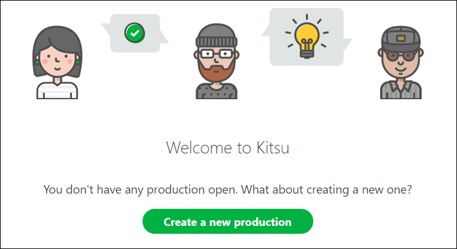
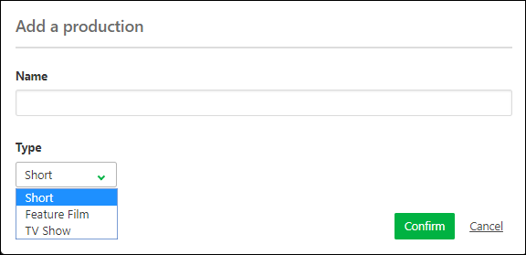
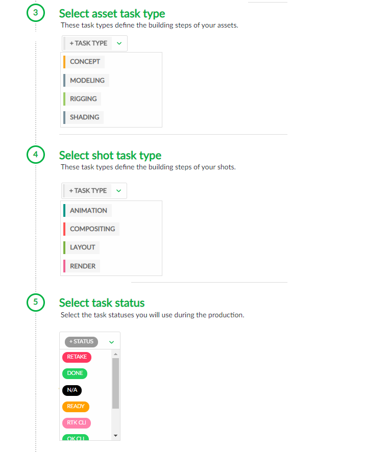

# Create a Short Production (assets and shots)

Now that you have designed your workflow in Kitsu and invited more people, it's time to create your production.

Click on the **Create a new
production** button.

Enter your production name, choose **short** as the **type**, and select your production style (2D, 3D).

Then, you must fill in technical information, such as the number of FPS, the Ration, and the Resolution.

All these data will be used when Kitsu re-encodes the video previews uploaded.

Then, you need to define your production's start and end dates.

You can define your production workflow in the next part, 3 to 6.

You need to select your asset task type (3), shot task type (4), task status (5), and asset types (6).

::: tip
To create your **Production Workflow**, you will select Task Types from the Global Library.

If you realize you missed some Task Types, you can create them later.

See the [Studio Workflow](../../../configure-kitsu/index.html#studio-workflows) section.
:::

Then, 7 and 8 are the option parts. If you already have a spreadsheet with your asset/shot.

See the **import CSV** section for more details.

[Import asset](#create-an-asset)

[Import shot](#create-shots-from-an-edl-file)

Validate everything with the  button.