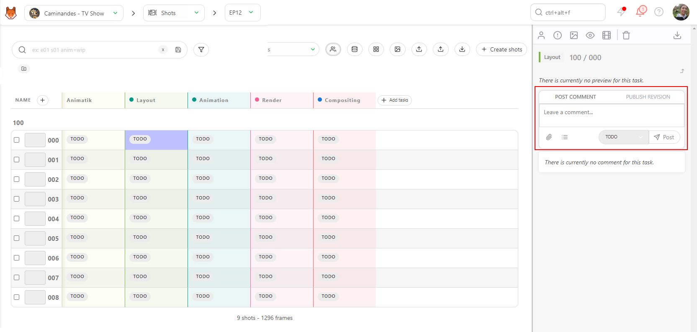
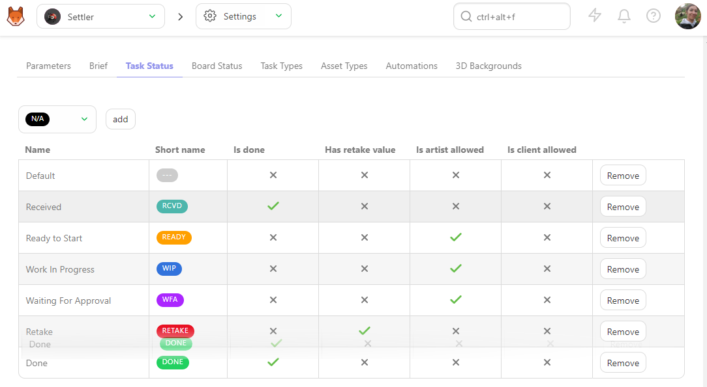

# Status

## Change Status and Add a Comment

To change the status of a task and write a comment, you need to click on the
status of the task.

It makes a panel appear on the right, and here, you can write a comment, change the status, and attach a file.

The **Comment Panel** is split into two tabs : 
- POST COMMENT
- PUBLISH REVISION

To change the **Status**, stay in **POST COMMENT** tab.

The comment uses the **Markdown** language. If you need specific syntax, feel free to look at the markdown guide website: https://www.markdownguide.org/basic-syntax/

On the **Leave a Comment...** section, you can **tag** someone on the team in the comments. Type the `@`and it opens a sub-menu with the list of the team.

You can also **tag** a full department by typing '@' and the department's name.

You can add a **checklist** to your comments.

You need to click on the **Add checklist** button, and the first item of the checklist appears.

Type your comments, hit the **Enter** key to add another line to your checklist, or click the **Add Checklist** button again.

In addition to your comment, you can attach a file as a picture. Click on the **Add attachment** button.

Select a **file from your hard drive** or past a **screenshot** here.

Validate the attachment by clicking on **Add file as attachment**.

Then select the **Status** that you need on the dropdown menu. 

Then click the **Post** button to post it to the world.

## Change Status per Batch

Alternatively, you can do it per **batch**.

You can select multiple shots or assets by pressing the **ctrl** or
**shift** key.

Then, go to the action menu's **Change status** section.

Choose the new status for your selected tasks (1). You can also add a comment for all the selected tasks (2)
You validate the new status with the **Confirm** button.

The shots are not sorted by name but by the metadata column information.

You can also select in the menu if you want to edit the name of the metadata column and its information or if you want to delete it.

You can also use the **CSV Import** to quickly fill your custom metadata column.
First, you must create your **Metadata column** into Kitsu, add it to your spreadsheet, and copy-paste your data into the **CSV Import**.

[Update Shots information with CSV Import](../batch-action/README.md#update-shots-information-with-csv-import)

## Select the status for the Artist board page

When you assign a task to an artist, they will see it on their to-do page when they log in.

But they can also choose to display their task as a board view. Each **Status** will be a column, and the assigned task is a card that can be moved from status to status depending on the task's progress.

To setup the board view, you need to go to the settings page of your production.

Then go to the Task Status tab. You will see a list of the statuses used in your production.

It will be the same status used as the column on the board page. You can drag and move the statuses to change their order as they appear on the board view.

The next step is with the **Board Status** page.

Depending on the permission, you can choose which status will be displayed on the **Board** page.

Once it's done, your artist should have a page like this.

