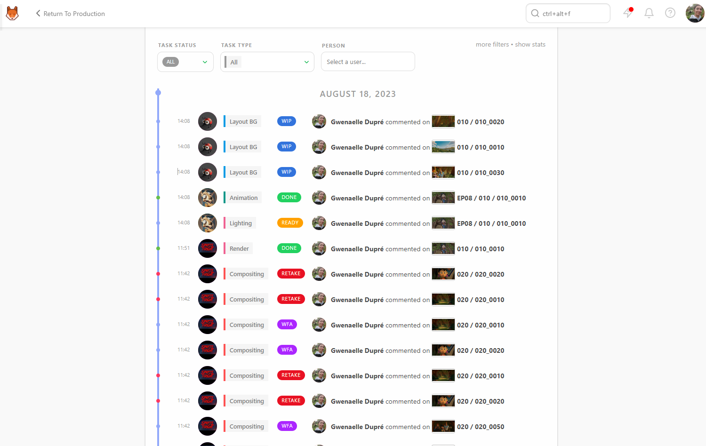
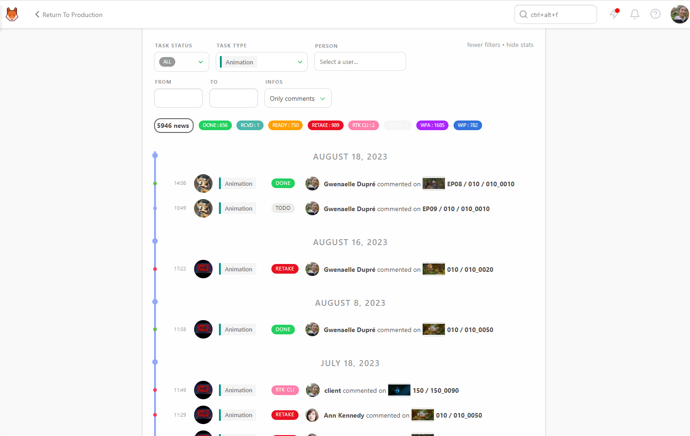
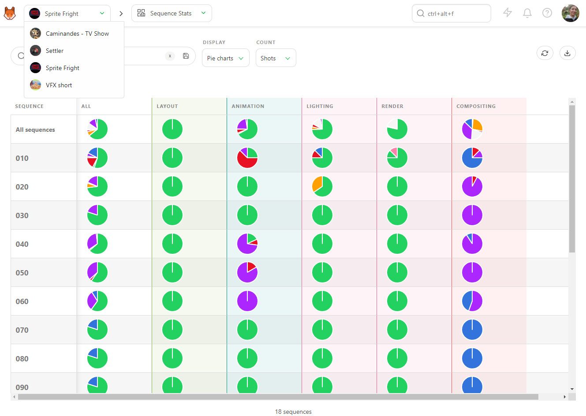
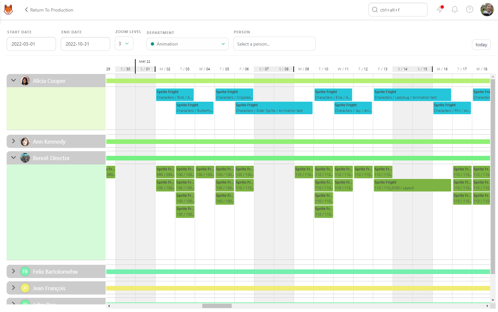
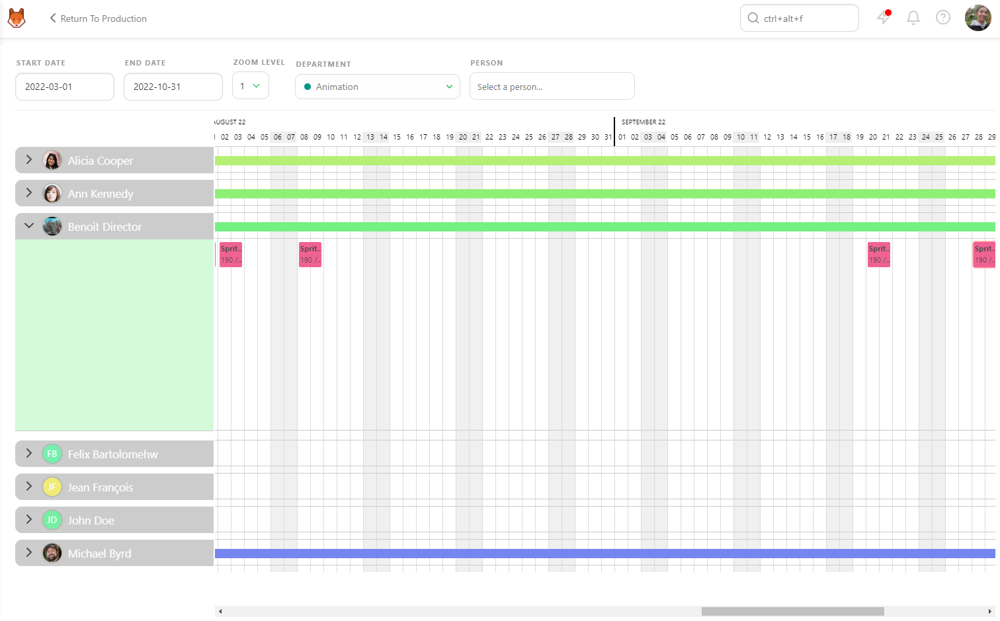

# Build a Studio Report

## Know Everything that is Happening in the Studio

As a Producer, you need to know everything.

Usually, it's done by knowing everything by heart all the time. You need to double the number of meetings with your production team or double-check everything yourself all the time.

Otherwise, you could subscribe to all the tasks and be drowned by the notification, which will get you out of
 focus every time you stop what you are doing to read them.

The perfect solution will be to have all the Production changes on one page, always up-to-date.

Welcome to the **New Feed** page.

Here you can see all the status changes minute by minute.

You can filter the list per **Task Status**, **Task Type**, and per **Person**.

If you click into a line, the comment panel will open on the right and give you all the information you need.

If you click on **Show Stats**, you will see the sum-up of the number of news, the total number, and the per status number.

With the **Filters Builder** button, you can define the time frame to display the information.

For example, if you want to focus on a supervisor, for example, for a specific month, you can select its name and then pick a date on the **From** box.

## Know the Current State of the Productions 

As a Producer, the important thing is to know the status of your Production anytime, anywhere.

So once again, you can learn everything by heart or look at the **statistics pages**.

With the **Sequence Stats** page, you have access to the pie charts of the whole production on a single page,
 sequence per sequence.
 
 The color scheme of the pie charts is the same as the status. So with a glance, you know immediately what is
the state of your Production.

The first line is **all sequences**, meaning the whole Production, and the first column **All** is all the tasks simultaneously.

If you focus on this first pie chart, you have the exact state of your Production. If you need more detail, you can look at the rest of the line for a global view of each task type state.

You have the same level of information for the asset with the **Asset Types Stats**.

You can also display data as **Counts**. This way, you'll see the exact number of shots / frames with the percentage per status.

Export this page as a `.csv`text file and import it into spreadsheet software.

You can navigate from Production to Production with the **Navigation** menu at the top of the screen. You will stay on the same page, so you can check all the Production's stats by selecting Production by Production.

## Know the Occupancy Rate of the Studio - Team Schedule
 
As a Producer, you must have a global picture of your studio and everyone working here.

With the **Team Schedule**, you can see all artists with tasks assigned. Each line is an artist, and if you unfold the artist line, you will see the details of their tasks.

You can focus on a specific timeframe with the **Start** and **End Date**. You can adjust the zoom level to have more detailed information on the assigned tasks. 
You can choose to see all **Departments** or only a specific one, and of course, focus on only one **Person**.

If an Artist has several tasks to do on the same day, the tasks will be pilled up, **one line for one task**.

You can move the tasks around by grabbing them and putting them on another day. All the changes you make on the **Team Schedule** will be applied to the **task type schedule**.

If an Artist has a break between two tasks, the sum-up line won't break to show it. The sum-up line shows you the first and last task assigned to the Artist.
 

## How to Check the Main Schedule

With the **Main Schedule**, you can access all the **Production Schedules** at once. 

If you unfold a production, you will have the detail of each **Task Type** used in this Production; if you unfold each Production, you can see if you need the same team simultaneously.

You can move each **Task Type Bar** to adjust the schedule and fit the studio needs. 

Each change you make will be applied to the Production.

