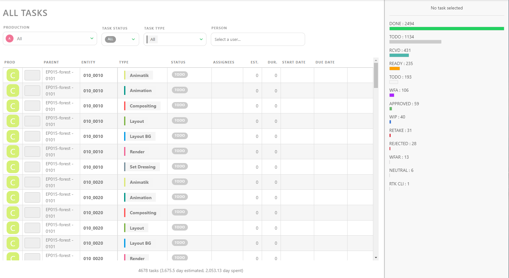

# Building Studio Reports

## Studio Resource Overview

As a Producer, you need to know everything.

Usually, this involves keeping track of numerous details, attending multiple meetings with your production team, and constantly verifying everything yourself. Alternatively, you could subscribe to all the tasks and be overwhelmed by notifications, which disrupt your focus every time you stop to read them.

The perfect solution is to have all the production stats on one page, always up-to-date.

Welcome to the **All Tasks** page.

Here, you can see the status of all productions at once. You can filter the list by **Production**, **Task Status**, **Task Type**, and **Person**. Clicking on a line opens the comment panel on the right, providing all the information you need.

If you need more detailed information, especially about a specific timeframe, you can use the **Studio > News Feed** page.

With the **Filters Builder** button, you can define a specific time frame.

For example, if you want to focus on the workload a supervisor for a specific month, select their name and then pick a date in the **From** box.

## Current State of All Productions 

To ensure your studio functions smoothly, you need to stay on top of all ongoing productions. This is where the **Productions** section can help. Access it from the global menu under the **Studio** section.

From there, click on the **Load stats** button to see the current state of your productions.

For more detailed information, visit the **Sequence Stats** and **Asset Types Stats** pages of all the productions.

### Stats Pages

The **Sequence Stats** page provides pie charts of the entire production on a single page, broken down by sequence. The color scheme of the pie charts matches the status, allowing you to quickly understand the state of your production.

The first line is **all sequences**, representing the whole production, and the first column, **All**, includes all the tasks simultaneously.

By focusing on this first pie chart, you can see the exact state of your production. For more details, look at the rest of the line for a global view of each task type's state.

The **Asset Types Stats** page provides the same level of detail for assets.

You can also display data as **Counts**, showing the exact number of shots/frames with the percentage per status.

You can also export this page as a `.csv` text file to import it into spreadsheet software.

Navigate from production to production using the **Navigation** menu at the top of the screen. You will stay on the same page, allowing you to check all the production stats by selecting each production.

## Studio Occupancy Rate

The **Team Schedule** allows you to see all artists with assigned tasks. Each row represents an artist, and unfolding an artist's row will show the details of their tasks.

### Focusing on Specific Timeframes

You can focus on a specific timeframe by setting the **Start** and **End Date**. Adjust the zoom level to get more detailed information on the assigned tasks. You can choose to see all **Departments** or only a specific one and focus on a single **Person**.

If an artist has several tasks on the same day, the tasks will be piled up, with **one line for each task**.

### Modifying the Schedule

You can move tasks around by grabbing them and placing them on another day. Any changes you make on the Team Schedule will be applied to the task type schedule.

If an artist has a break between two tasks, the sum-up line will not break to show it. Instead, it shows the first and last tasks assigned to the artist.

## Utilize the Main Schedule

With the **Main Schedule**, you can access all the **Production Schedules** at once.

If you unfold a production, you will see the details of each **Task Type** used in that production. By unfolding multiple productions, you can which teams are being utilized simultaneously.

You can move each **Task Type Bar** to adjust the schedule to fit the studio's needs.

::: warning
Each change you make will be applied to the Production Schedule.
:::
