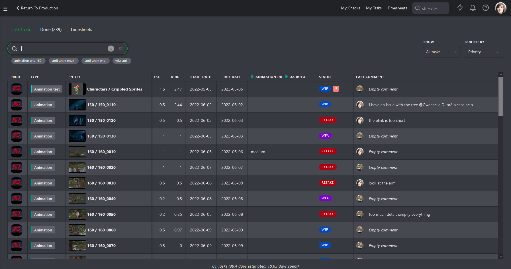
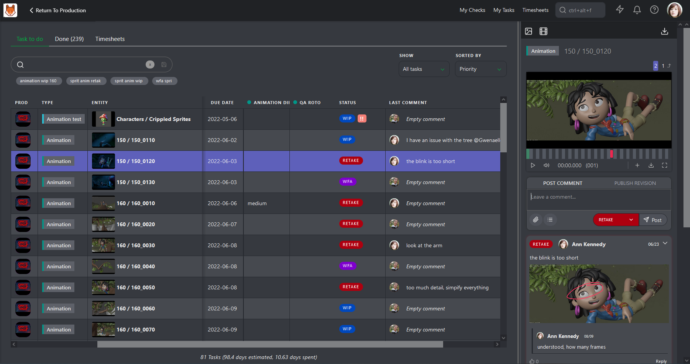
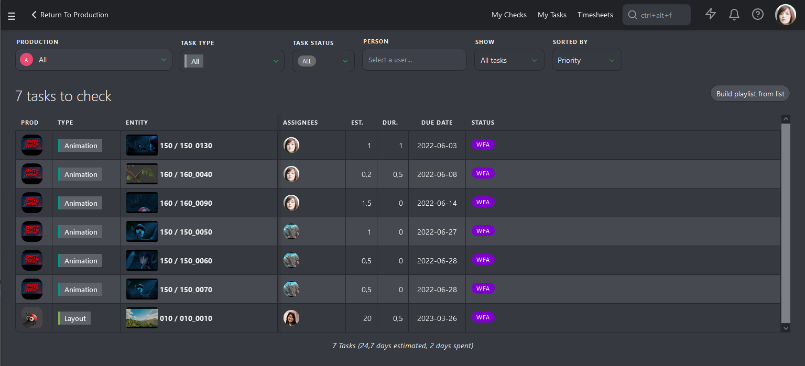
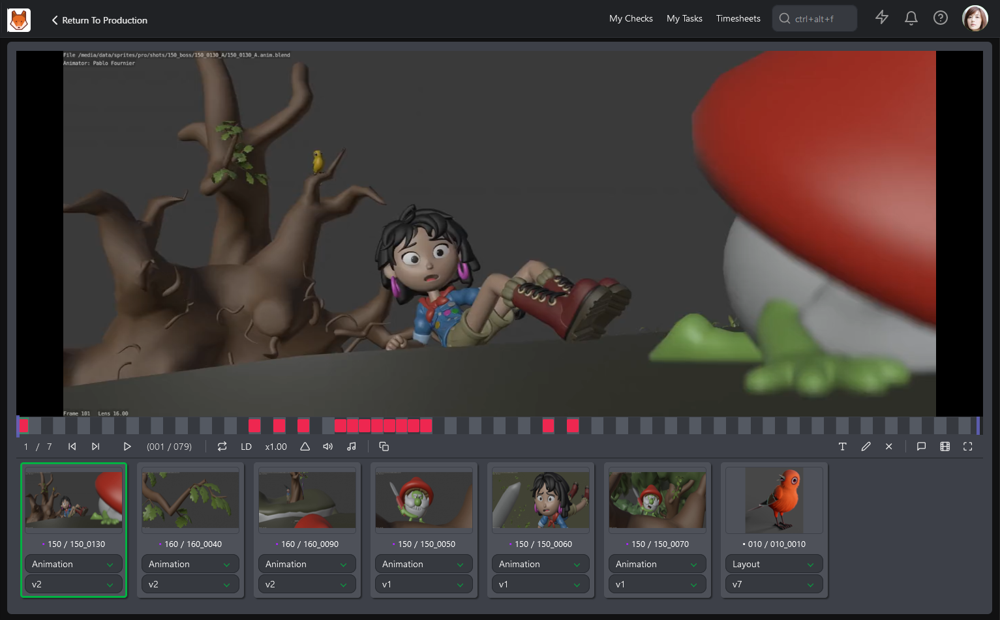
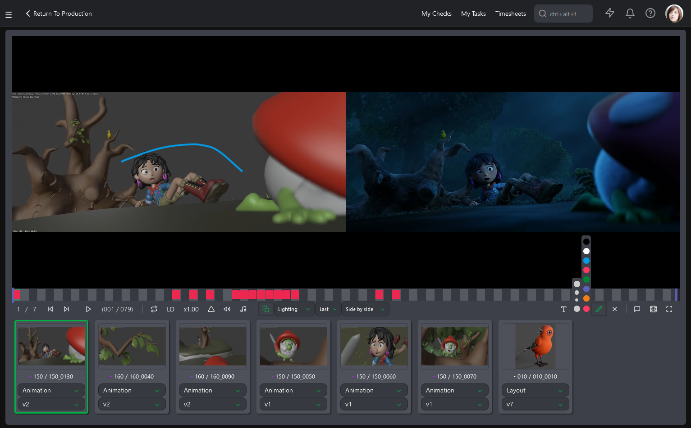
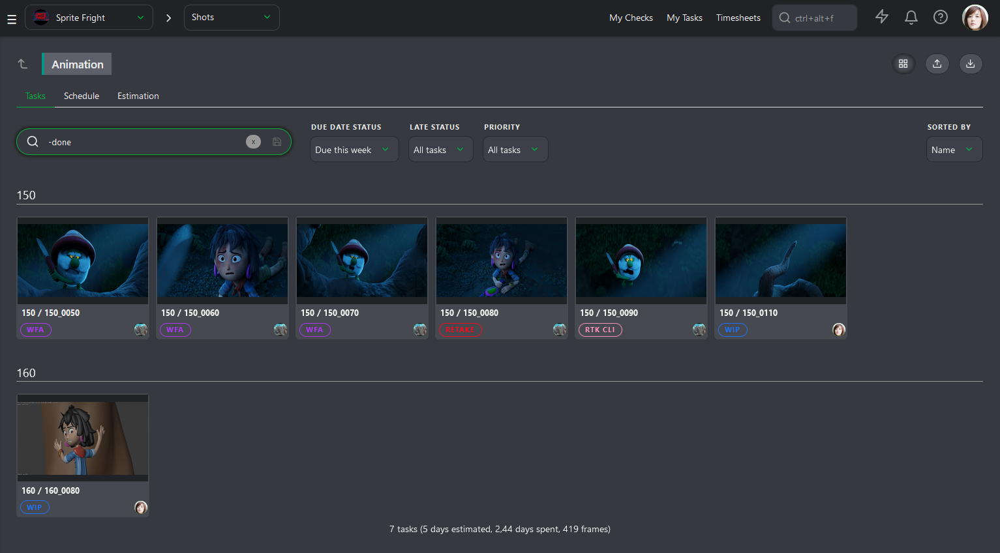
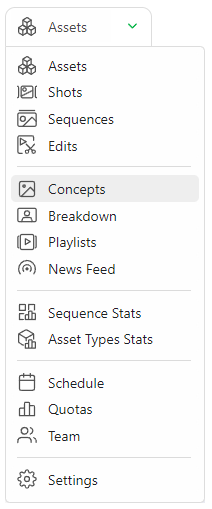
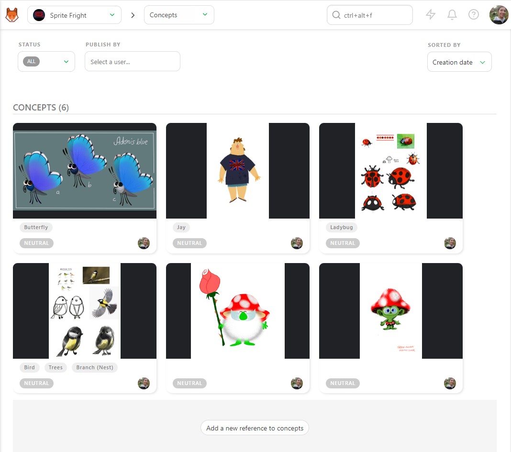
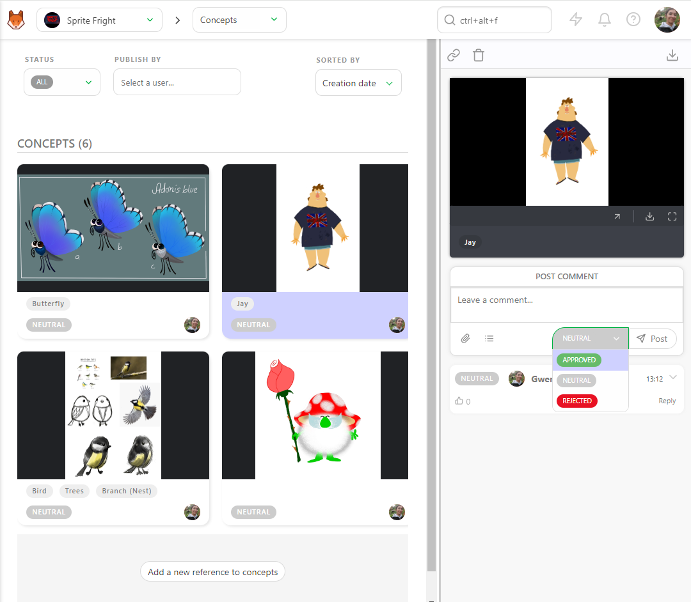
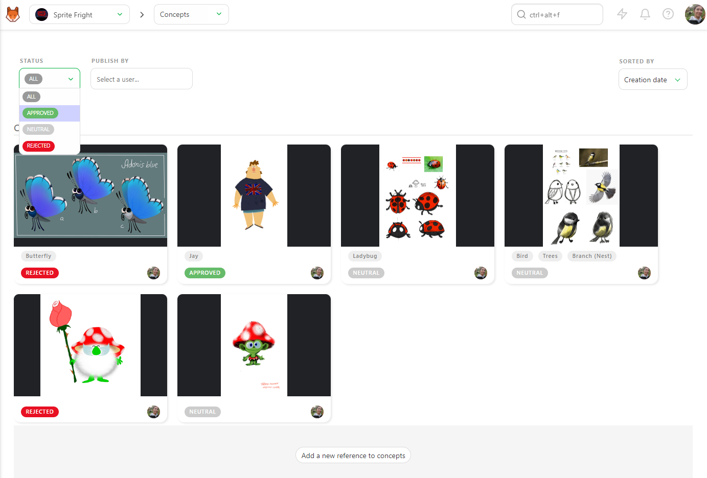

# Check and Supervise your Tasks

## Check your Tasks

As a Supervisor, you usually have tasks assigned in addition to supervising your department.

So, it means splitting your time between your work and supervising your team.

Let's start with how to check what you have to do.

When you log into Kitsu, you will notice the button on top of the screen **My Tasks**. 
It's direct access to your **to-do list**. Per default, it's sorted by priority, so you don't have to think twice about what to do first; it's the one on top of the list.

On the My Tasks page, you can filter the tasks list by Production, Task Type, Status, etc. 

Then, you must click on the **Status** to open the comment panel. From here, you can comment and publish a new revision.

You can also use the Board view to drag and drop your task onto the new status column.

## Check the Previews of your Department

Now that everyone in your team knows what to do, you must check their work.

Usually, when an artist has finished a task, he will call you and ask for your review.
So it means you must stop what you're doing, lose your focus, open their preview, focus on it, comment, and try to get back where you're stopped.

It's a lot of wasted energy here, and you could be more productive, no thanks to all the intrusion.

And the more you are interrupted, the longer it takes to regain focus.

That's why we suggest you set a specific timeframe for your checking. The first advantage is that it will help your team be better organized. The artists will know when it's a good time to speak with you, and they can post their work and start a new task, knowing you will check it.
The second advantage is that you can focus on your work! You know when the checking is and when to do your tasks. 

If you click the **My Checks** button at the top of the screen, you will see the list of all your department's **WFA** tasks.

This list covers all the **Productions**, **Task Type**, and **Task Status** relevant to you.

As with any other page in Kitsu, you can click on a **Status**, open the **Comment Panel** on the right, and do your review task per task.

Or you can also use the **Build playlist from list** button. Kitsu will create a playlist with all the tasks on the list displayed.

This **playlist** has the same options as others; you can open the comment panel, compare version and task types, and draw and write text.

Another solution is to go to the **Task Type Page** and change the **Display as contact sheet**.

For example, You can filter per **Due Date Status** and select **Due this week**.

You can now click on the contact sheet to open the comment panel or select several tasks to create a playlist.

## Check a Concept

Once your artists upload the concept, you can review it.

To review the concept, you use the navigation menu at the top of the screen and select the concept page.

You can see all the concepts uploaded and the status, assignation, and linked assets.

To review a concept, click the status part to open the comment panel. You can enlarge the comment panel or go fullscreen.

Then, write a comment, select the status **Approved** or **Rejected**, and validate with the **Post** button.

You can filter the page with the **Status** filter to display all the **Neutral** status concepts.

You can also filter per artist and change the order sort.

