# Manage your Department(s)

Now, it's time to focus on your team. The first step is to assign tasks.

## Assign and Estimate Tasks to your Department
Your view is automatically filtered on the global shot/asset page as **My Department**. You only see your **Task Type** and the **Custom Columns** linked to your department.

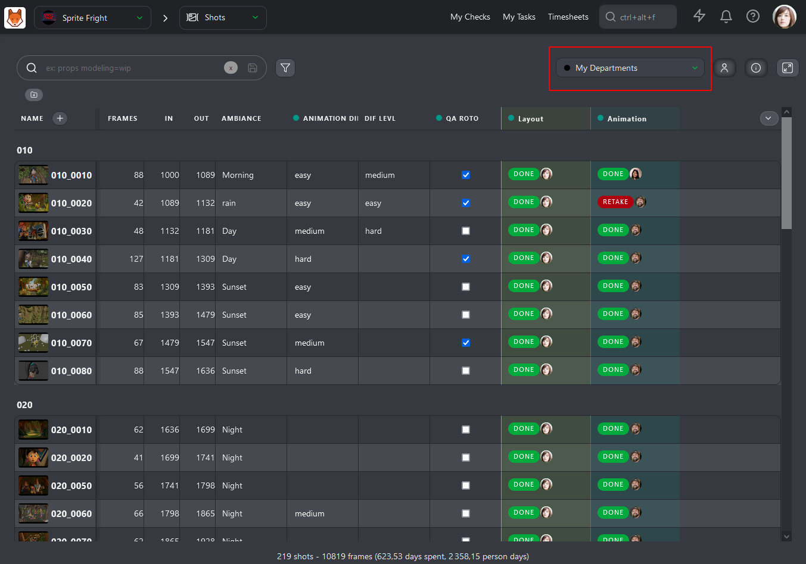

When you assign one or several tasks to someone, you will notice that you only have access to the people from your department. 

It's faster for you to find the right Artist for the Task.

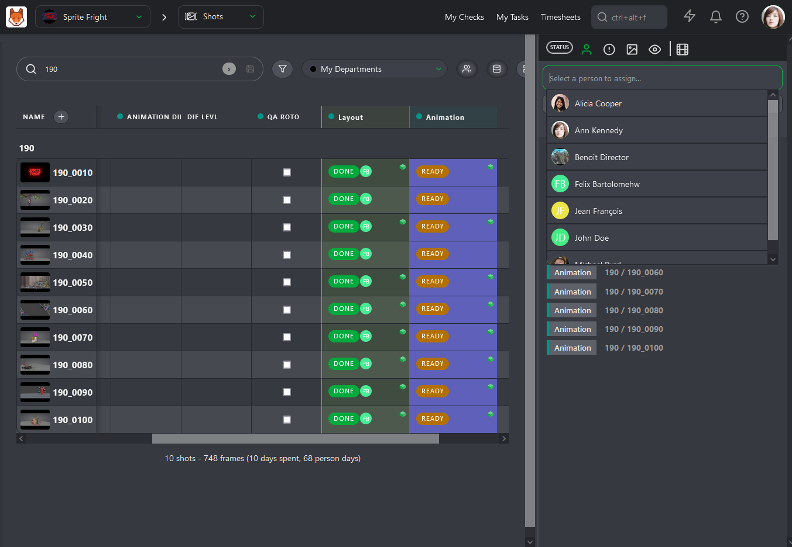

Now that you have assigned all your Artists, it's time to fill in the **Estimation** for each Task.

Click on the name of a **task Type** column to open its dedicated page.

On this page, you can access three tabs: **Tasks**, **Schedule**, and **Estimation**. We will focus on the last one.

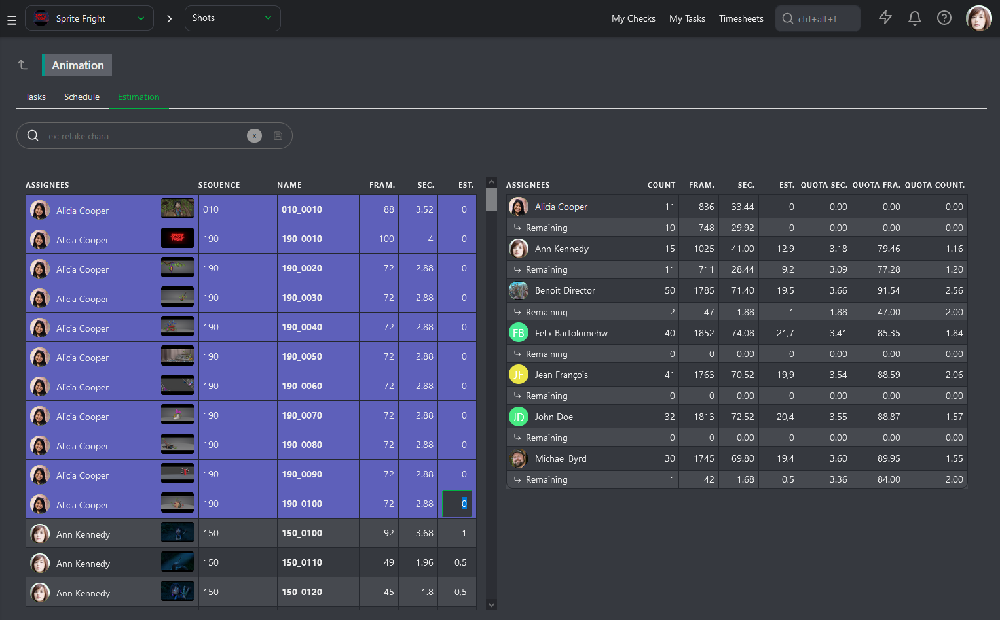

The **Estimation** page is split into two parts. On the left, you have all the tasks sorted by Artist, their number of frames, and seconds.

On the right part of the screen, you have the sum-up of your team, one line per Artist. You will have the **Count** of the total number of assigned tasks, the total number of **Frames** and **Seconds**, and the updated total number of days **Estimated**.

With all this information, Kitsu can calculate different estimated **Quotas**: **per Second**, **per Frame**, and **per Task**.

You can now fill the **Estimation** column on the left and see the result on the right.

As soon as you fill in an **Estimation** for a task, you will see the artist line updated on the right part.

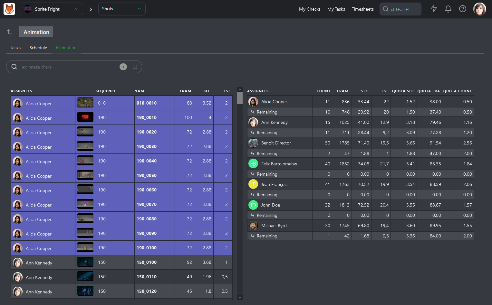

You know if the distribution of the tasks is fair between your team member and what are their estimated quotas for production. 

You need to do it according to their experience and the difficulty of each Task.

## Supervise Daily your Team

Once the assignations and estimations are done, you can focus on managing your team daily.

You can directly access the **Task type Page** by clicking its name from any page to ease your effort and focus only on important matters.

Once you are on the detail page, your first action is to click on the **Display tasks as a contact sheet**  button.

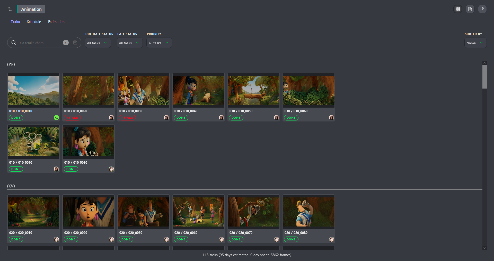

Now, you can easily focus your work on the build filters.

For example, you might be looking for what you should have finished this week without seeing what you have already done.

Use the **-done** filter, and with the **Due Date Status** filter, select **Due This Week**.

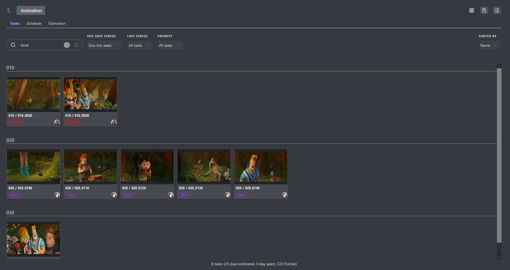

You can navigate from filter to filter to ease your work and always have the right information.

::: tip
If you need more information about a task, click on it to open the comment panel on the right.

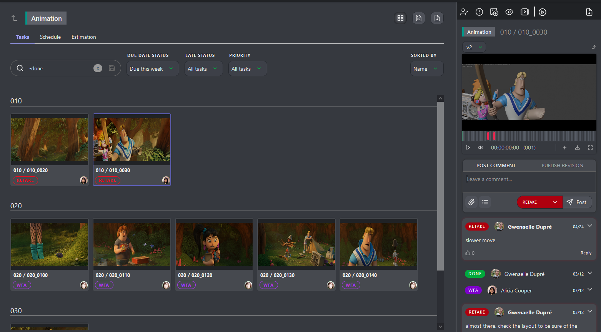
:::

## Supervise the Schedule of your Department

As a Supervisor, you can access your team schedule on the main menu under the STUDIO section.

From this schedule, you can see all the artists working with you unfold a person and the details of their tasks.

From there, you can 
- Move the Task to change the start and due date

- Adjust the length of the Task

- Drag and drop the Task to someone else to change the assignation

- See the days off

## Supervise the Quotas of your Department

At the beginning of the production, while you set estimation for each Task, you also define estimated quotas for each of your Artists.

Once a task is validated, the remaining line on the Estimation tab of the Task Type page will update and display the remaining number of tasks and the updated estimated quotas.

You can monitor each team member and see if their estimated quotas stay within the first established range.

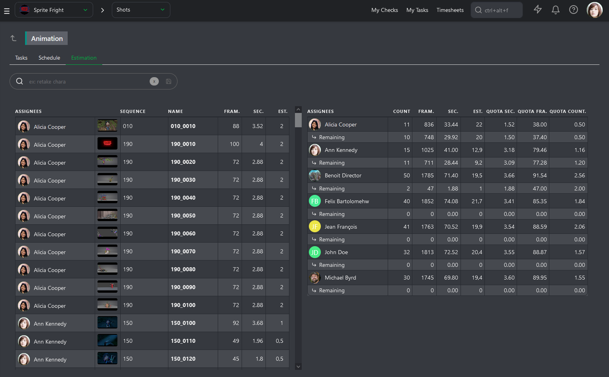

When you need to check on their **Actual Quotas**, go to the **Quotas** page. 

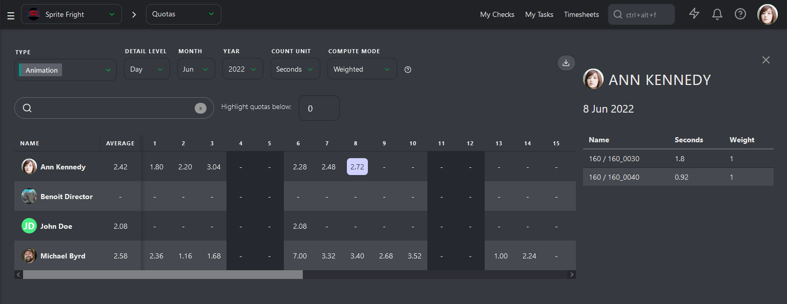

Kitsu has two ways to calculate the quotas. The first is based on the daily timesheets filled out by the artists.

The quotas will be calculated as soon as the Artist fills out his first timesheet on this Task and will end when he stops.

The second way is based on the status. The calculation starts with the **WIP** status and ends with the **WFA** status.

It's **First take** quotas, meaning that the back-and-forth of comments won't be entered in the calculation.

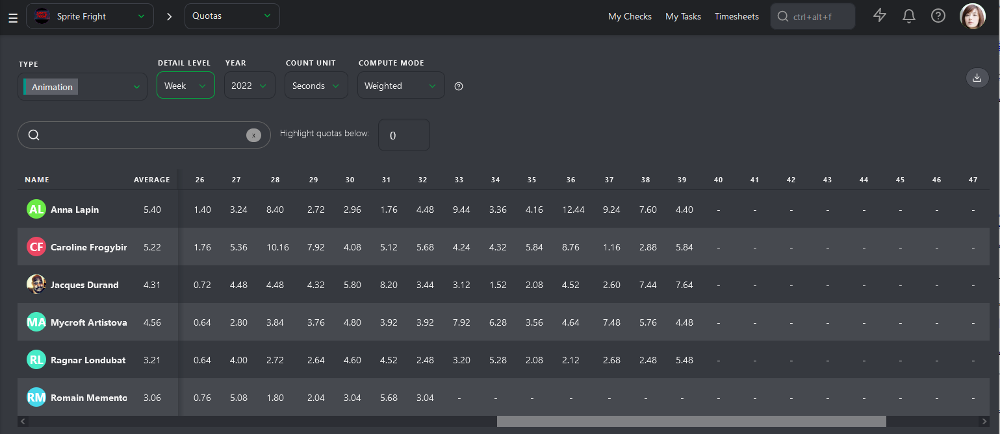

The first column, **Average**, is this page's most important element. Kitsu will calculate the average quotas for each Artist per **Day**, **Week**, or **Month**.

## Supervise the Timesheets of your Department

As a Supervisor, you also have to monitor your team's hours. The Timesheet page shows how many hours they work daily, week, and month. 

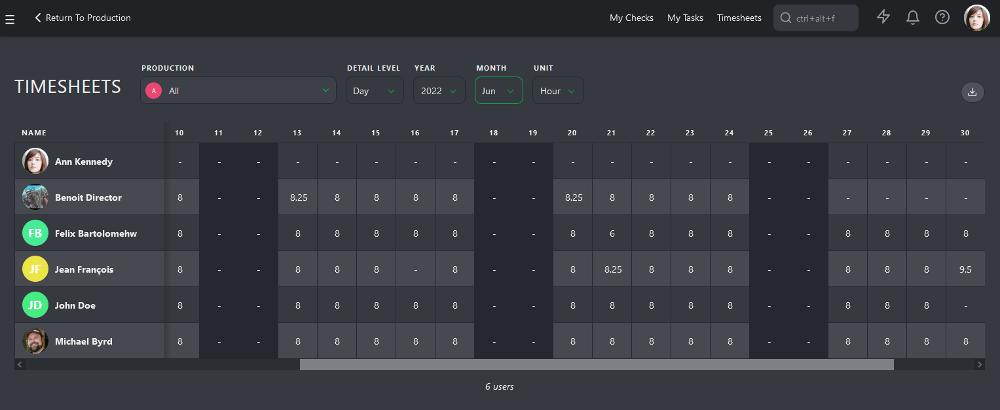

It's time to notice a pattern of extra hours, sick days, or no vacation. It's also your job to take care of your team, speak with them, and see if everything is fine if they are not burning.

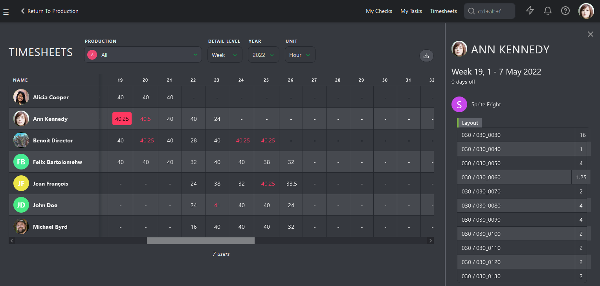
