# Create a TV Show Production

Now that you have designed your workflow in Kitsu and invited additional team members, it's time to create your production.

Click on the **Create a New Production** button.

Enter your production name, choose **TV Show** as the **type**, and select the style of your production (2D, 3D).

Next, fill in the technical information, such as the number of FPS, the aspect ratio, and the resolution.

::: warning
All this data will be used when Kitsu re-encodes the video previews you upload.
:::

Next, define the start and end dates for your production.

You can define your production workflow in the next part, 3 to 6.

You need to select your asset task type (3), shot task type (4), task status (5), and asset types (6).

::: tip
To create your **Production Workflow**, select Task Types from the Global Library.

If you realize you missed some Task Types, you can create them later.

[See Getting Started With Kitsu](../configure-kitsu/README.md)
:::

Then, steps 7 and 8 are optional. If you already have a spreadsheet with your assets or shots, refer to the **import CSV** section for more details.

Validate everything with the  button.

## Introduction to Kitsu's Global Page

Welcome to Kitsu's global asset page. Let's take a look around.

At the top, you have the **global navigation**, which is always visible throughout all the production pages.

**From left to right:**

### Main Menu

By clicking on the top left button, Kitsu  (or your Studio logo), you will open the Main Menu.

In the Main Menu, you will find direct access to your assigned tasks, productions, global and team schedules, the workflow customization page, and Kitsu settings.

::: details Main Menu Details
**WORKSPACE**
- **My Tasks:** Your assigned tasks.
- **My Checks:** All tasks with the status **Is Feedback Request**, depending on your department(s).
- **My Productions:** Return to the production selection page.

**STUDIO**
- **Productions:** List of all productions (opened or closed) with details.
- **People:** List of all the people (active or not) in your studio with information.
- **Timesheets:** Details of the time entered by the team across productions.
- **Main Schedule:** All your productions in one schedule.
- **Team Schedule:** Schedule of all the people in your studio and their tasks.
- **All Tasks:** Access all tasks across all productions at once.
- **News Feed:** Stay updated on what happened.
- **Entity Search:** Find any assets or shots across productions.

**ADMIN**
- **Departments:** Create and edit departments.
- **Task Types:** Create and edit task types.
- **Asset Types:** Create and edit asset types.
- **Custom Actions:** Create and edit custom actions.
- **Automation:** Create and edit automation.
- **3D Backgrounds:** Add HDR backgrounds.
- **Bots:** Create and edit bots.
- **Settings:** Set up your studio.
- **Logs**

::: warning Permission Visibility
The WORKSPACE section is enabled for all permissions except My Checks, which artists do not see.

Artists (and above) can also see their own **Timesheets** and have access to the **Entity Search**.
:::

### Navigation

You will see the navigation dropdown menu to the right of the main menu icon.

You can choose between different productions. The name of the current production and the current page are always displayed.

Use the dropdown menu to navigate from one production to another if you have several. Once you have selected a production, the next dropdown menu will help you navigate through the different pages of that production.

::: details Navigation Details
The first section is about tracking your tasks:
- **Assets**
- **Shots**
- **Sequence**
- **Episodes**
- **Edits** (If you have created specific tasks)

The second section focuses more on the production side:
- **Concepts**
- **Breakdown**
- **Playlists**
- **News Feed**

The third section is about statistics:
- **Sequence Stats**
- **Episodes Stats**
- **Asset Type Stats**

The fourth section is related to team management:
- **Schedule**
- **Quotas**
- **Team**

The fifth section is about the settings of your production:
- **Settings**

::: tip
You start with the asset page, but you can change your production homepage to other entities (see settings page).
:::

::: warning
If you realize you don't need an extra level of navigation, such as **Episodes**, you need to change your production type to **Short**.
:::

### Global Search, News, Notification, and Documentation

To the right of the navigation dropdown menu, you will find the global search. This quick access search displays the first four results. For more results and filtering options, visit the **Entity Search** page in the Main Menu.

The next icon  is a direct link to our news and feedback page.

Here, you can see all the new features with animated GIFs and also add suggestions for the next feature you want to see in Kitsu.

Then, the bell icon  shows your notifications (assignments, comments, tags). The number of unread notifications will appear on the bell icon.

The last icon before your avatar is the documentation button , which you are reading right now!

### Personal Settings
You can click on your avatar to open your profile menu (Profile, Color Theme, Video tutorials, etc.).

## The Tasks Spreadsheet

### Entity Spreadsheet

The second part of the screen is common to all entities (Asset, Shot, Sequence, Edit). This is the global tasks spreadsheet.

Here, you can see the status, assignment, priority, and other details for each task.

::: tip
The first row and column header of the spreadsheet always remain at the top of the page, even when you scroll down.

You can also **stick** other columns to keep them visible at all times.
:::

### Filters

The first element on the left is the filter box. You can type anything you want for simple filtering, such as sequence, asset type, etc.

For more advanced filtering, please use the filter builder button.

You can save all the filters and use them as your pages.

### Simplify the Display

On the right part of the screen, there are some buttons (from left to right) to hide or display the assignment, hide or display the extra column, enlarge or reduce the thumbnail.

### Import / Export
Here we have the Batch import thumbnail , and finally import  or export  data.

### Metadata Column
Below, you have the name of the column. The (+) next to **Name**  is here to create a new metadata column. Then, you have the name of the task type column.

### Customize the View
On the far right of the screen, next to the scroll bar, is the option to hide and display an extra column (everything but the task type).

.

### Sum-up of your view
The last part (4), at the bottom of the screen, is the sum-up of your displayed page. It means the sum-up will update if you filter the page.

You can see the number of elements (assets or shots), the total number of estimated days, and the total number of days already spent.

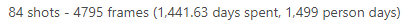

## Create an Asset
### Create Your First Asset

Now that we have created our production and have a general grasp of the Kitsu interface, it's time to create our very first asset.

On the asset page, click on **Add Assets**.

::: warning
When you create an asset, your task workflow will be applied, and **all tasks will be created simultaneously**.
:::

A pop-up window opens:

- It asks you to choose the **Asset Type** (1). If you haven't added a new asset type, Kitsu will provide examples such as Characters, Environment, FX, Props. Let's start with a character.

::: tip
You can also customize the asset type list and the task pipeline. [See Asset Types Workflow](../configure-kitsu/README.md#specific-asset-types-workflow)
:::

Link this asset to an Episode (Kitsu provides the **Main Pack** by default, which is not editable or removable) and select a first episode to help you get started **E01**. You can rename or delete E01.

- Give it a **Name** (3) and enter a description to help the artist know what to do and quickly identify the asset.

- Click on **Confirm and Stay** if you have multiple assets to create.

You can change the asset type and continue adding assets.

::: tip
The newly created asset appears in the background whenever you click on **Confirm and Stay**.
:::

After adding your last asset, click on **Confirm**. It will create the asset and close the window.

::: tip
If you click on **Confirm and Stay** but realize you don't have more assets to add, click on **Close**, and the window is canceled.
:::

You will also see that the tasks selected for your asset's workflow are created at the same time.

If you need to add more **Assets**, click the **+ Create Assets** button.

::: details Create Assets from a CSV Spreadsheet File
You may already have your asset list ready in a spreadsheet file.
With Kitsu, you have two ways to import them: the first is to import a `.csv` file and copy-paste your data directly into Kitsu.

First, save your spreadsheet as a `.csv` file.

Then, go back to the asset page on Kitsu and click on the **Import** icon.

A pop-up window **Import Data from a CSV** opens. Click on **Browse** to pick your `.csv` file.

To see the result, click on the **Preview** button.

You can check and adjust the column names by previewing your data.

Note: the **Episode** column is only mandatory for a **TV Show** production.

Once everything is correct, click the **Confirm** button to import your data into Kitsu.

Now, you have imported all your assets into Kitsu and created the tasks according to your settings.

:::

::: details Create Assets by Copying / Pasting a Spreadsheet File

Open your spreadsheet, select your data, and copy them.

Then, go back to the asset page on Kitsu and click on the **Import** icon.

A pop-up window **Import Data from a CSV** opens; click on the **Paste a CSV Data** tab.

You can paste your previously selected data and see the result with the **Preview** button.

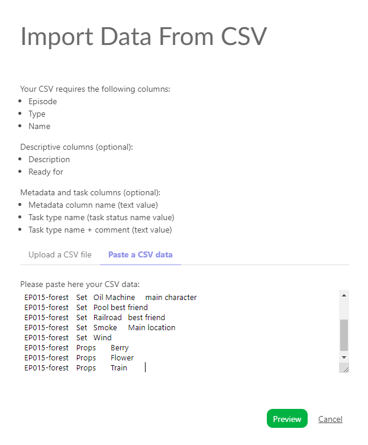

You can check and adjust the column names by previewing your data.

Note: the **Episode** column is only mandatory for a **TV Show** production.

Once everything is correct, click the **Confirm** button to import your data into Kitsu.

Now, you have imported all your assets into Kitsu and created the tasks according to your settings.

:::

### Viewing Details of an Asset

To see the details of an asset, click on its name.

A new page opens with the list of tasks, assignments, and status updates on the right.

You can click on the status of each task to open the comment panel and view the history of comments and different versions.

You can also access the following:

- **Casting**

- **Concepts** linked to this asset

- The **Schedule** is available if you have previously filled out the task type page data. If the data has already been filled out, you will be able to modify them directly here.

- The **Preview Files** uploaded at various task types

- And the **Timelog** if people have filled out their timesheets on the tasks of this asset.

## Update Your Assets
You can update your assets at any point, change their name and asset type, modify their description, and add any custom information you added to the global page.

To edit assets, go to the asset page, hover over the asset you want to modify, and then click on the **Edit** button  (1) on the right side of the line.

To view the full description on the main asset page, click on the first words (2), and a pop-up with the full description will open.

To delete an asset, see the FAQ: [How to Delete an Asset](../faq-deletion/README.md##how-to-delete-an-asset).

::: details Update Assets with the CSV Import
You can use the CSV import to update your data quickly.

You can update the **type** of an asset, the **Assignment**, the **Status** of tasks, and add a **Comment**.

You need to switch on the option **Update existing data**. Then, the lines that will be updated will be highlighted in blue.

:::

::: details Update Assets by Copying / Pasting a Spreadsheet File

Open your spreadsheet, select your data, and copy them.

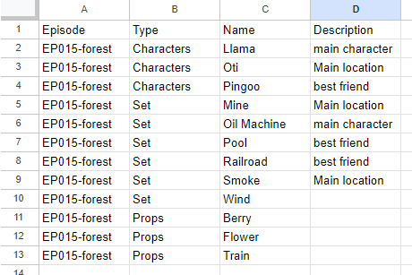

Then, go back to the asset page on Kitsu and click on the **Import** icon .

A pop-up window **Import Data from a CSV** opens; click on the **Paste a CSV Data** tab.

You can paste your previously selected data and see the result with the **Preview** button.

You can check and adjust the name of the columns by previewing your data.

You need to switch on the option **Update existing data**. Then, the lines that will be updated will be highlighted in blue.

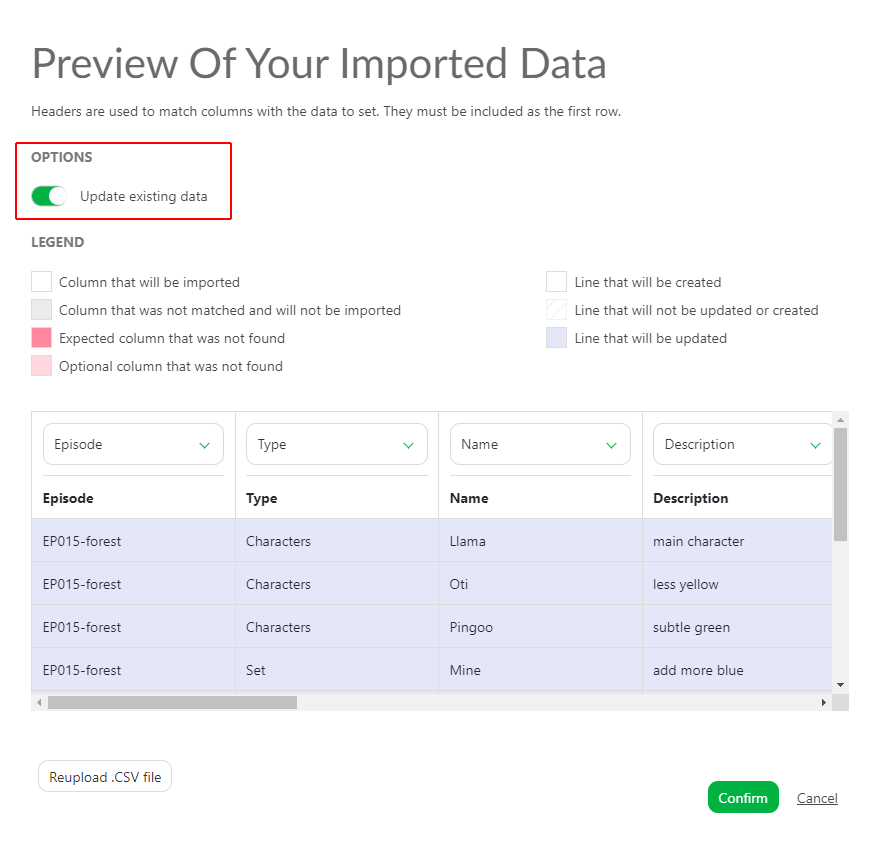

Now, you have imported all your assets into Kitsu and updated the tasks according to your settings.

:::

## Add More Tasks After Creating the Assets

If you realize **after** creating the assets that tasks are missing, you can still add them.

First, ensure that the missing task type is added in the settings page under the task type tab (otherwise, [See Getting Started with Kitsu](../configure-kitsu/README.md)).

Then, go back to the asset page and click on **+ Add Tasks**.

## Create a Concept
### Upload a Concept

To create a **Concept**, navigate to the **Concepts** page using the navigation menu.

To upload a concept, click the **Add a new reference to concepts** button.

You can upload one or several concepts at the same time.

Once you upload your previews, the concept page will look like this.

You can interact with the concept in two ways: click on the picture to see an enlarged view. The second is to click on the status part to open the **Comment Panel** on the right.

On the comment panel, you have two options: link a concept to an existing asset or delete it. You can also comment and change the status of the asset.

The idea is to have one version per **Concept**. If it's not approved, you need to upload a new concept, not to have multiple versions of the same concept.

One concept is one task.

### Link a Concept to an Asset

Once concepts are uploaded, you can link them to the assets.

You can see the links on the status part of the assets.

Click on the status part of the concept; it will open the comment panel on the right.

On the comment panel, you have two options at the top: Link a concept to an asset and delete the concept.

To link an asset, click on the **Link**  button.

Kitsu will display all the **Assets** available to link with the concept uploaded.

Kitsu will list the linked assets at the top of the comment panel. For now, there are No Links.

To link an asset, click on it. The linked assets' names will appear at the top of the screen under the preview of the concept.

Once a concept is linked to an asset, it can be seen on the asset's detail page.

Return to the asset page, and click on the asset name you want to see the concept.

Per default, the casting detail is displayed on the second part of the screen. 
Use the dropdown menu to choose the concept.

Once in the concept section, you will see all the concepts created for this asset. You can filter them per status.

## Create a Shot
### Create Your First Shot

It's time to create **shots** for your production.

::: warning
**Shots** are linked to a **Sequence** which is also linked to an **Episode** in Kitsu.
This means you must create an episode, then a sequence, and populate this sequence with shots.
:::

Navigate to the **Shots** page using the dropdown menu and click on **SHOTS**.

Click on the **Add Shots** button to start with shot creation.

::: warning
When you create a shot, the task workflow you have designed will be applied, and all the tasks will be created at the same time as the shot.

[See Getting Started With Kitsu](../configure-kitsu/README.md)
:::

A new pop-up opens for the creation of the shots.
You can now create Episodes, sequences, and shots.

Kitsu provides a first episode as an example **E01**; you can select it and add to it your first sequence, for instance, sq01,
then click **Add**.

Now, you can see your sequence has been created. To add shots to this sequence, you need to select it and create your shots.

For example, type sh0010 in the shots column, then click **Add**.
You can also define padding for your shots.

::: tip
If you want to name your shots ten on ten as SH0010, SH0020, SH0030, etc, set the **Shot Padding** as 10
:::

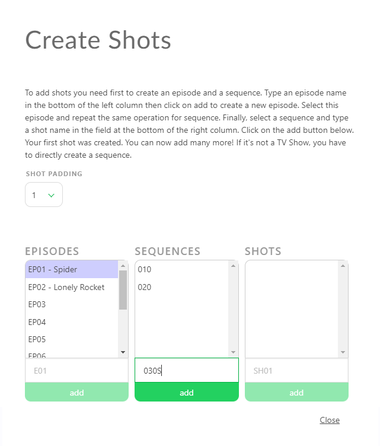

You can now see that new shots are listed and linked by their sequence, and the shelves are linked to the Episode.
You have created the first shot of the first sequence of the first Episode.

Now, let's add more shots than just one! As you can see, the box already contains your name
code but incremented, so you have to continue to click on **Add** to
create more shots.

To add more sequences, go to the left part, type the name of your new sequence, and then click on **Add**.
Your second sequence is selected, and you can now add shots.

You can follow the same process to add more episodes.

Once you create a new episode, it will be selected and created sequentially.
Once the sequence is created, it will be selected, and you can create shots on this sequence.

::: tip
If a shot is misplaced on a sequence, you have to edit the shot
, and change the
sequence. 

**But you can't change the Episode of a shot.**

:::

To delete a shot, see the FAQ: [How to Delete a Shot](../faq-deletion/README.md#how-to-delete-a-shot)

To delete a sequence, see the FAQ: [How to Delete a Sequence](../faq-deletion/README.md#how-to-delete-a-sequence)

## Create Shots from an EDL File

You may already have your shots list ready in an **EDL** file. With Kitsu, you can directly import your **EDL** file to create the sequence, shot, number of frames, and Frame in and out.

On the **Global Shot Page**, you will see an **Import EDL** button.

You can select the naming convention of the video file used during the editing on the pop-up.

It means the video clip on the editing is named as project_sequence_shot.extension.

Here is an example of an EDL for the LGC production.

The video files are named  LGC_100-000.mov, which means LGC is the production name, 100 is the sequence name, and 000 is the shot name.

You can import the EDL file once you are set with the naming convention.

Then click on **Upload EDL**.

Then Kitsu will create the shots.

::: details Create Shots from a CSV Spreadsheet File
You may already have your shots list ready in a spreadsheet file. With Kitsu, you have two ways to import them; the first is to import a `.csv` file directly, and the second is to copy-paste your data directly into Kitsu.

First, save your spreadsheet as a `.csv` file.

Then, return to the shot page on Kitsu and click the **Import** icon.

A pop-up window **Import data from a CSV** opens. Click on **Browse** to pick your `.csv` file.

To see the result, click on the **Preview** button.

You can check and adjust the name of the columns by previewing your data.

NB: the **Episode** column is mandatory for a **TV Show** production.

Once everything is good, click the **Confirm** button to import your data into Kitsu.

Now, all your shots are imported into Kitsu, and the task is created according to your **Settings**.

:::

::: details Create Shots by Copying / Pasting a Spreadsheet File
Open your spreadsheet, select your data, and copy them.

Then, go back to the shot page on Kitsu and click on the **Import** icon 
.

A pop-up window **Import data from a CSV** opens; click on the **Paste a CSV data** tab.

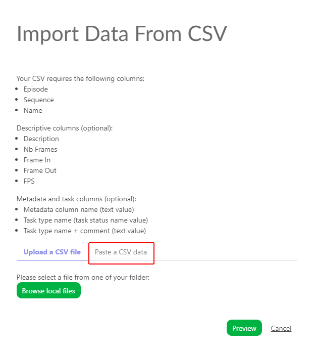

You can paste your previously selected data and see the result with the **Preview** button.

You can check and adjust the name of the columns by previewing your data.

NB: the **Episode** column is only mandatory for a **TV Show** production.

Once everything is good, click the **Confirm** button to import your data into Kitsu.

Now, all your shots are imported into Kitsu, and the task is created according to your **Settings**.

:::

### See the Details of a Shot

If you want to see the details of a shot, click on its name.

A new page opens with the list of the tasks, the assignation, and the status newsfeed on the right.
You can navigate through each by clicking on the name of the tabs.

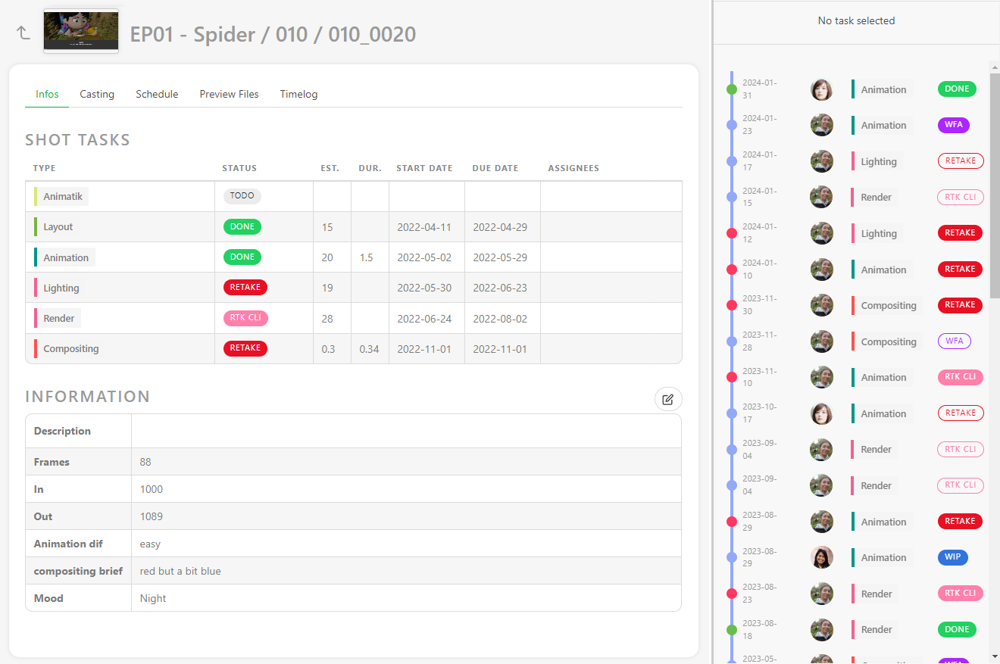

You can click on the status of each task to open the comment panel and see the history of the comments and the different versions.

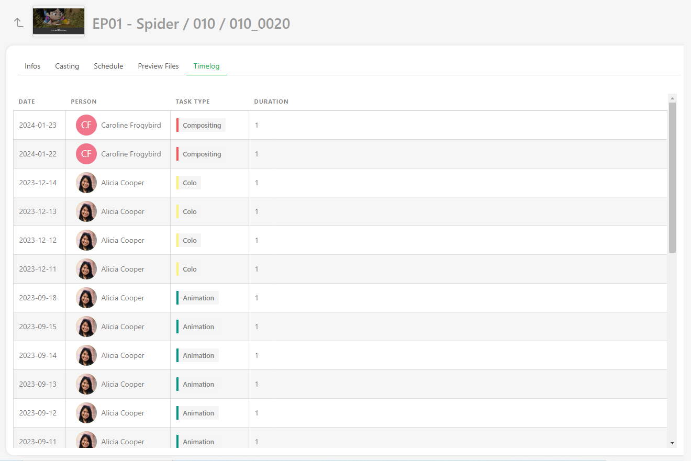

You can also access the **Casting**, 

The **Schedule** is available if you have previously filled out the task type page data. If the data have already been filled out, you will be able to modify them directly here. 

the **Preview Files** uploaded at various task types, 

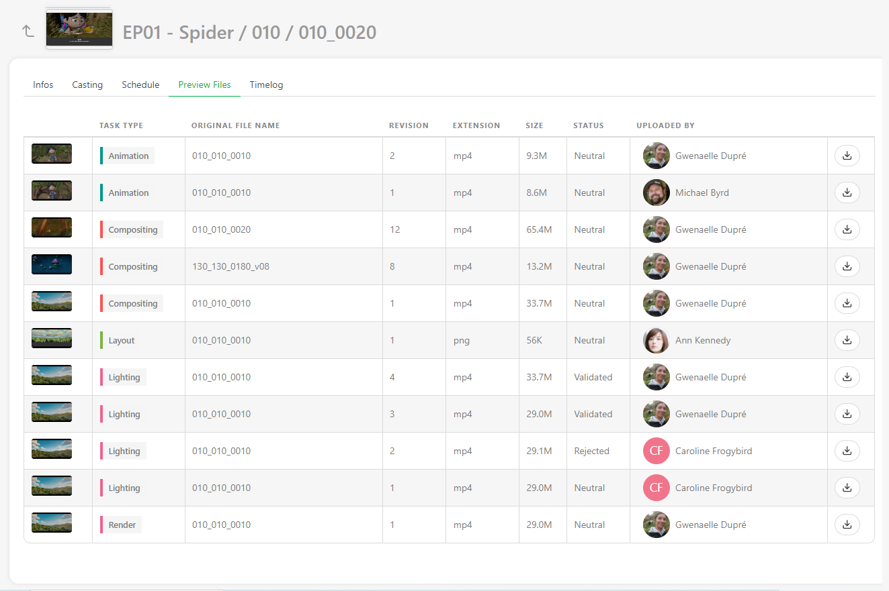

And the **Timelog** if people have filled out their timesheet on the tasks of this asset.

## Update your shots

You can update your shots at any point, change their names and sequences, modify their descriptions, and add any custom information you added to the global page.

You can edit shots by going to the shot page, hovering over the shot you want to modify, and then clicking on the **edit** button
 (1) on the right side of the line.

To extend the description on the main shot page, click on the first words (2), and a pop-up with the full description will open.

::: details Update Shots Information with CSV Import
You can use the **CSV Import** to update your data as the **NB Frames**, **Frame IN**, **Frame Out**, or any custom **Metadata column**.

You can update the **Assignation**and the **Status** of tasks and add a **Comment**.

Open your spreadsheet, select your data, and copy them.

Then, go back to the shot page on Kitsu and click on the **Import** icon 
.

A pop-up window **Import data from a CSV** opens; click on the **Paste a CSV data** tab.

 
You can paste your previously selected data and see the result with the **Preview** button.
 

  
You need to switch on the **Option: Update existing data**.
The updated shots will be in blue.

 
NB: the **Episode** column is only mandatory for a **TV Show** production.
 

Once everything is good, click the **Confirm** button to import your data into Kitsu.

Now, all your shots are imported into Kitsu, and the task is created according to your **Settings**.

:::

## Add more tasks after creating the shots
If you realize after creating the shots that the task is missing, you can still add them.

First, ensure the missing task type is added to the settings page under the task type tab (otherwise, http://localhost:8080/tvshow/#update-your-shots)).

Then go back to the shot page and click on + Add tasks.

## Adding Frame Numbers and Ranges to Shots

At this stage of production, the animatic should be complete. This means you have the duration (number of frames) and the frame range (Frame In and Frame Out) for each shot. You can input this information into the spreadsheet to ensure accurate frame calculation without any missing or redundant frames.

::: warning
If you've manually created your shots and sequences, the Frame column might be hidden. To reveal it, you need to edit at least one shot and input the number of frames. Alternatively, if you've imported the number of frames via CSV/spreadsheet, the Frame column will be visible.
:::

To add frame range information to shots, follow these steps:

1. **Edit Shots:** Click on the edit button () located on the right side of the shot line.

   

2. **Input Frame Range:** In the editing window, enter the In and Out frames for the shot, then save by clicking the Confirm button.

   

   The frame range will now be displayed on the general spreadsheet of the shot page.

   

3. **Fill Frame Information:** Once the Frames, In, and Out columns are unlocked, you can directly input data from the global shot page. Simply click on the case you want to fill in and add the data.

   ::: tip
   If you input Frame In and Frame Out, Kitsu will automatically calculate the Number of Frames.
   :::

   

4. **CSV Import:** You can also utilize CSV Import to swiftly update your frame ranges. [Update Shots information with CSV Import](README.md#update-your-shots)

5. **Access Shot History:** You can view the history of shot values, including frame ranges.

   

   

## Creating Custom Metadata Columns

To include additional information on the general spreadsheet pages, you'll need to create a custom **metadata column**.

You might have extra details to add, such as **level of difficulty**, **weather**, **tags**, etc. All textual or numerical information can be stored in the custom metadata column.

::: warning
Any Custom Metadata Column created in one episode will be applied to all episodes.
:::

Follow these steps to create a custom metadata column:

1. **Add Column:** Click on the **+** near the Name column.

   

2. **Choose Type:** With the Type option, select how you want to store your information:
   - **Text**
   - **Number**
   - **Checkbox**
   - **List of Values**
   - **List of Tags**
   - **Checklist**

   

   ::: warning 
   - **Text**, **Number**, and **Checkbox** allow you to add different information for each entity without prior planning.
   - **List of Values**, **List of Tags**, and **Checklist** offer the same options for each entity and must be filled in advance.
   
   
   Type the list elements below Available values and confirm them by clicking on Add value.
   :::

3. **Link to Departments:** Optionally, you can link the metadata column to one or several departments. This allows artists/supervisors to view it on their to-do page and in department-filtered views.

   ::: tip
   To link a metadata column to a department, click on the department from the list and then click on **add** to apply it.

   Here, the VFX column is linked to two departments.

   
   :::

   ::: details Edit Metadata Column
   On the global page of the asset or the shot, click on the arrow to the right of your metadata column and select **Edit**.

   
   :::

4. **Fill Information:** You can input information directly on the global spreadsheet page. The cases are editable.

   

   ::: tip
   You can batch-modify the metadata column by selecting several entities on the left and then modifying your metadata column.
   :::

   ::: details Edit Manually
   You can also modify the information manually by clicking the edit button ().

   You'll see a new line on the edit pop-up where you can select the information from the list, enter free text or a number, check a box, or use a checklist, depending on your previous choice.

   Remember to press the Confirm button when you're done.

   
   :::

5. **Edit or Delete:** To edit or delete the metadata column, go to the general spreadsheet page. Next to the name of your metadata column, click on the arrow.

   ::: tip
   You can also sort your global page with this new column by clicking the arrow on the right of the column name to open its menu and then selecting Sort By.

   You can also Stick the metadata column to the left.
   :::

## Create a Sequence

In Kitsu, you can also track tasks at the **Sequence** Level.
It's especially useful when
you have macro tasks to track, like Story and color Board, Color Grading, etc.

Use the navigation menu to go to the **Sequences** page.

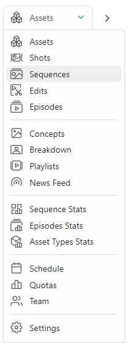

::: warning
This new page behaves like the asset and shot global page.

To use this page, You first need to create dedicated task types on your **Global Library**
 with the **Sequence** attribute.

 [See How to Create a New Task Type](../configure-kitsu/README.md#studio-workflow-create-a-new-task-type)

Once you have created your **Task Types**  on your **Global Library**, add them to your
**Production Library** (setting page).
:::

Once your task types are ready on the settings page, you need to create a sequence (the same as the assets or shots).

This new page behaves like the asset and shot global page. You can add your edits with the **+ New Sequence** button.

You can assign tasks, do the review, change status, etc.

You can add a metadata column, fill in the description, etc.

::: tip
You can create a sequence directly from here (**+New sequence** button) or create a sequence linked to your shots from the global shot page.
:::

You can **Rename** and **Delete** the Sequence entity on this page, as for the asset and shot entity.

If you click on the name of a sequence, you will see the detail page of this sequence.

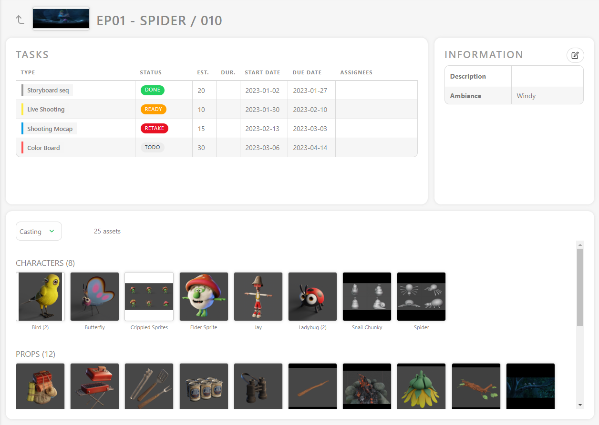

On the detailed page, you have access to the sequence casting.
You can see all the assets used in the whole sequence.

You can also access the schedule, Preview Files, Activity, and Timelog of the sequence **tasks**.

## Create an Edit

You can track tasks at the **Edit** level in Kitsu.

It's especially useful when you have several edits to track through several validation steps. For example, you can track your whole movie, several trailers, and the First Edit, Fine Edit, Mix, etc.

::: warning
By default, the **Edit** page will not be displayed until you have task types for it in your **production library** (setting page).

[See How to Create a New Task Type](../configure-kitsu/README.md#studio-workflow-create-a-new-task-type)
:::

To use this page, you need to first create a dedicated task type in your **Global Library** with the **Edit** attribute.

Once you have created your **Task Types** in your **Global Library**, add them to your **Production Library**. After this, you will see the **Edit** option displayed in the navigation drop-down menu.

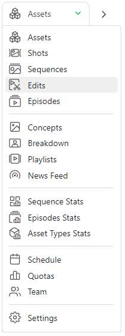

This new page behaves like the asset and shot global page. You can add your edits with the **+ New edit** button.

You can assign tasks, conduct reviews, change status, etc.

You can also add a metadata column, fill in the description, etc.

::: tip
Depending on your deliveries, you can also change the resolution per **Edit**.
:::

::: warning
The detail page is different from the other entities.

As **Edit** focuses on a specific long video, the detail page resembles the comment detail page more closely.
:::

You can **Rename** and **Delete** the Edit entity on this page, similar to the asset and shot entity.

## Create a Breakdown List

Filling out the breakdown helps you with the assembly of the shots. With the
breakdown, you have all the details of the assets you need to add to create your
shot, and we are sure to omit nothing.

On the dropdown menu, choose **BREAKDOWN**.

On the left of the breakdown page is the episode/sequence/shot menu (1); you can choose between those you created. They are the right part of
the screen; all the assets created are available for this production (main pack and episodes) (3). Moreover, in
the middle section, it is your selection for the shot (2).

So now you have to select the shot you want to cast.

You can display the assets as text if you don't have thumbnails yet or enlarge the
thumbnails size.

You may also realize an asset needs to be added to the list during your breakdown.

You can create a new asset directly from the breakdown page. Click the **+** on the right of the **All available assets**.

You can also choose multiple shots at once. Click on the first shot, hold the **shift** key, and click on the last shot of your selection.

Then click on the assets you want
to assign: characters, backgrounds, ... from the right part (3).
If you have selected multiple shots, your selection is applied to the numerous shots.

Copy a shot filled with assets and paste this asset selection into another shot.

You can see a **+1** or **+10** when you pass over the asset. It's the number
of times you add this asset, and you can click on it as many times as you need.

You can also link all your assets to episodes on a TV show without specifying a sequence or shot.

This way, you can link all your assets to one or several episodes before the storyboard/animatic stage.

You can now see the asset in the middle of the screen (2). Next
to the asset's name is the number of times it has been added. In this
example, we have added the character asset Llama two times.

If you add an asset twice by mistake, you must go to the screen's middle part to select assets for this shot (2). From there, click on
**-1**. When you finish this shot, go on with the other shots.
Your selection is automatically saved.

If a new asset is created during the storyboard, return to the asset
page (using the dropdown menu) and create the needed assets. The tasks previously created are applied immediately to these new
assets. However, you have to do the assignment, and then you can
continue with the breakdown.

Now, your **Breakdown** page should look like this.

You can also make a breakdown list for your assets if you need to assemble them and keep track of the separate parts.

On the top left corner of the screen, choose **asset** in the dropdown menu below **FOR**.

You can now access a second dropdown menu to choose your asset type: **Character**, **Environment**, **Props**, **FX**, ...

You can complete the asset breakdown page the same way you did the shots. First, select one or more assets on the left part and then add the right part's elements.

::: details Create a Breakdown List from a CSV File

You may already have your breakdown list ready in a spreadsheet file. With Kitsu, you have two ways to import it: the first is to import a .csv file directly, and the second is to copy-paste your data directly into Kitsu.

First, save your spreadsheet as a `.csv` file following Kitsu's recommendation.

Click on the **import** button 

A pop-up window **Import data from a CSV** opens. Click on **Browse** to pick your `.csv` file.

To see the result, click on the **Preview** button.

You can check and adjust the name of the columns by previewing your data.

NB: the **Episode** column is only mandatory for a **TV Show** production.

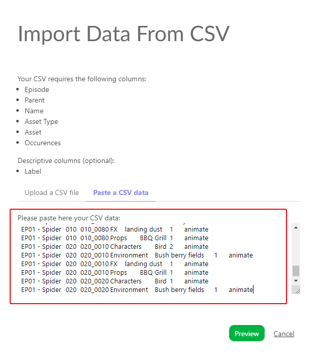

Once everything is good, click the **Confirm** button to import your data into Kitsu.

Now, you have your breakdown imported into Kitsu.

:::

::: details Create a Breakdown List by Copying / Pasting a Spreadsheet File

Open your spreadsheet, select your data, and copy them.

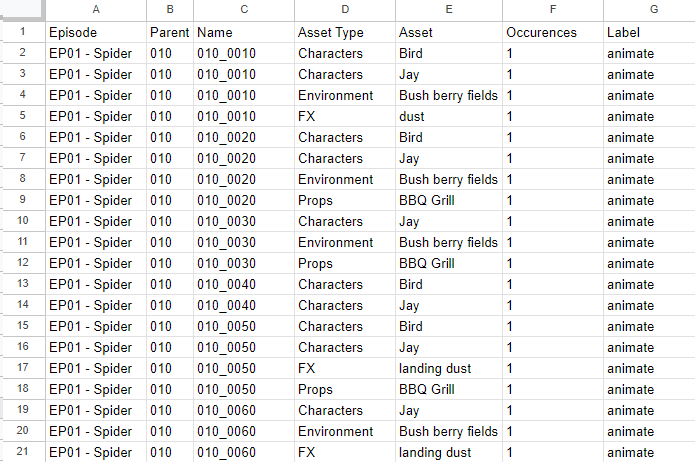

Then, go back to the breakdown page on Kitsu and click on the **Import** icon 
.

A pop-up window **Import data from a CSV** opens; click on the **Paste a CSV data** tab.

 
You can paste your previously selected data and see the result with the **Preview** button.
 

  
You can check and adjust the name of the columns by previewing your data.
 
NB: the **Episode** column is mandatory for a **TV Show** production.

Once everything is good, click the **Confirm** button to import your data into Kitsu.

Now, all your assets have been imported into Kitsu.

:::

## Introduction to Asset State: Ready For

Most of the time, you don't need to wait for an asset's tasks to be approved to use it on a shot task.

For example, when an asset is approved at the **Concept** stage, it can be used for the **Storyboard** stage.
Then, when it's approved at the **Modeling** stage, you can use it for the **Layout** stage and so on.

That's exactly what the asset state **Ready For** is doing: it lets you know the state of an asset's tasks and compares its usability for the shot tasks.

Now that we have filled out our breakdown, we know exactly which asset is used on every shot.

First, we need to define an asset's state relative to its task status. You can modify the **Ready for** by clicking on a cell. You will see a dropdown menu with the shot task.

::: tip
You can use the **automations** to do the heavy lifting for you.

You can set automation with the **ready for** trigger. 

[See How to Create Status Automation](../configure-kitsu/README.md#automation)

:::

Now that we have changed some asset states to **Ready for**, we can see the result on the shot page.

You can notice that some white boxes are now **Green**: all the assets cast in this shot are ready for this specific task.

If you see the white box, Kitsu will display how many assets are ready for this task.

 ::: tip
No assets are cast for this shot if you don't see any boxes.
:::
 
Then, you can click on the shot's name to go to its detail page.
Then, you will see all the assets cast in this shot and their status.

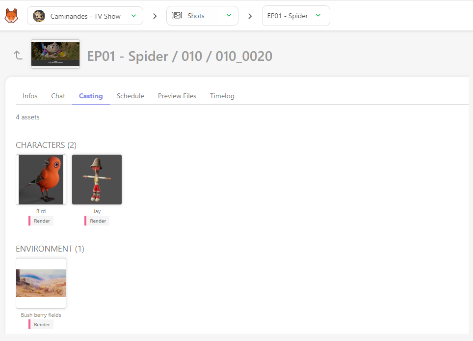

It's the fastest way to know if you can start a shot for a specific task.

