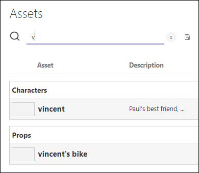
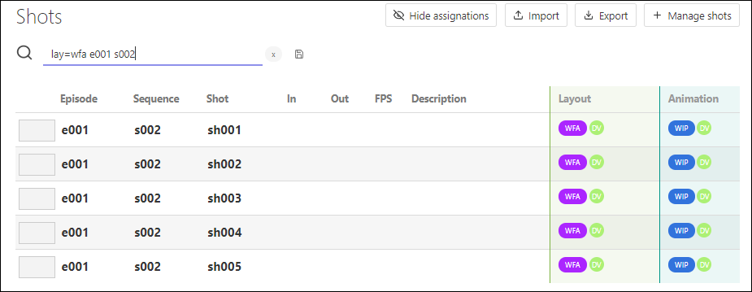
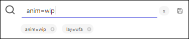

# FAQ for Kitsu

* ## Filters
	* [Introduction](#introduction)
	* [How Search Bar works](#how-search-bar-work)
	* [How to add Filters](#how-to-add-filters)
	* [What Filters can I create](#what-filters-can-i-create)
	* [How to delete Filters](#how-to-delete-filters)
 
 
### [Introduction](#introduction)

In **Kitsu**, the filters are linked to the **Search bar**. It gives you the opportunity to **save** your search and in a click, get back to it.
 

You can find the **Search bar** and the **save** option on different pages : 
* Assets page
* Shots page
* Sequence page

You can find the **Search bar** on a lot of other pages but the main difference will be the lack of the **Save** button next to it .

### [How Search Bar works](#how-search-bar-work)

The **Search bar** uses the autocompletion, so you don't need to type everything to get a prompt result.

For example type the letter `V` and you already get the result of all the assets starting with a V.

You can also search some specific **type of asset** : `Props`, `Character`, `Environment`, `Fx` ... The result will display all the assets under this type.

For example, lets search all the **FX** assets. 
	

Another example is to search a specifique **Sequence** on the **Shots page**. You want to see only the shots of the sequence 1 of the first episode.

If you only type "s001" the result will display all the shots of all the episodes which contain sequence 1.

To be more specific you need to detail your research : try `e001 s001`.

As you can see the result is more accurate.

On the same way, you can search **specific status** link to task. Type the **name of the task** (or the **first letters**), then add the sign **equal** (**=**) and the status you are looking for.

For example, search all the shots which are **Waiting for approval** (**WFA**) at the **Layout** stage. So on the search bar you will type : `layout=wfa` or `lay=wfa`.

You can be even more specific, lets focus on the first episode : on the search bar add a **space** after the previous search and type `e001`. You can be even more precise and ask to see only the sequence 2. The research will be `lay=wfa e001 s002` or `s002 e001 layout=wfa`.

### [How to add Filters](#how-to-add-filters)

Kitsu allows you to save your research. You can save them by pressing tne **Enter** key at the end of your typing, or click on the **Save** button .

Now under the **Search bar** you can see your previous searches as buttons. 

Everytime you get back to this page, the buttons will be there. It will help you to find the informations you need easier and faster.

### [What Filters can I create](#what-filters-can-i-create)

You can create **filters** about **entities** :
* **Episodes** : `e001`, `e002` etc.  
* **Sequences** : `e001 s001`, `s001 s001` etc.
* **Asset Type** : `characters`, `environment`, `fx` etc.

You can also create **filters** about **task status**: always use **task=status**, you don't have to type all the letter of the task, Kitsu will understand only the first. But the status has to be fully typed.
* Layout is Work in progress (wip) : `layout=wip` or `lay=wip`
* Concept is waiting for approval (wfa) only for the fx : `concept=wfa fx` or `fx con=wfa`
* On episode 2 Layout is wip : `e002 lay=wip` or `layout=wip e002`

### [How to delete Filters](#how-to-delete-filters)

If you have created a **Filter button** by mistake, click on the cross next to it .

The result of the filter will be display, but not the button anymore. Just cancel your research by deleting the text or use the cross next to the search bar 