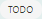

# How to get started with Kitsu as CG artist

## [First Connection](#first-connection)

On your first connection, we encourage you to fill your contact information
into your profile.
Click on your name on the top right of the screen (1) then on **Profile** (2).

NB: A link to this documentation is available in this menu too (3).
 

 
On this new page you can check your name (1) (2), your email (3), fill you phone
number (4), change the timezone (5), the language of the website (6), and
post a pic of yourself as your avatar (7). It will help to recognize who is
doing what! 
 

 
If you keep scrolling you can also change your password if you want. We
encourage you to change the default password with one of your own.

 
 
### [See your assignments](#see-your-assignments)
 
The main part for you, on **Kitsu**, will be the **My tasks** page. You can
find it on the main menu ,
under the **User** section of **MY TASKS**. The CGWire logo is a shortcut too,
to your task list.

You can see per **Production** (1) the **Entity** (2) you are assigned to, the
**Status** (3) of the tasks you are working on and their **priority** (4). 
 

 
### [Share your progress](#share-your-progress)

When you start a new task you are assigned to, click on the status 
(1) on the shots or assets page.

It will open a new page where you can communicate about your work. Let your
teammates know what you are doing. For instance show them you start working
on something. Each time you change the status of a task, you can attach a
text comment to it.

For example when you start a **new task** you can say that everything is ok.
If some information is missing, you can either ask all the questions you want.

To change the status, let's say from  to  as example, start
by filling the comment box (1). Then, click on the status box and choose the
one you want (2) and validate your comment and the new status by clicking on
**Post status** (3) button.

You can edit your last comment by using the **edit** button 
.

### [Ask for a review](#ask-for-a-review)

You can ask for a review by switching the status of a task to 
(**Waiting for Approval** ). This status allows you to share your progress by
posting a preview of your work. The first step is to change the status of your
task and post a comment. 

Then click on the **Add preview** button on your new post 
. 

A new window is displayed.

You can either drag and drop you pic or video on the **Choose a file** button,
or navigate through your system and pick your file, validate with the
**Confirm** button.

Your work will appear on the right part of the screen as a V1. 

If you post more revisiions, you will always keep track of your previous work.
Each time you add a new revision, the previous versions are still available. 

This detailed page of the task will be your way to communicate with others.
They will also use this page to answer your question, give you feedback, and 
asking for a retake. The history of the conversation is always available.

For a quicker access to the information, when you will get back to your todo
page, the last comment posted on each task will be available too.

You can also see the tasks validated as  on the **Done** tab.

### [Fill your timesheet](#fill-your-timesheet)

Everyday you can declare how much time you spent on each task. On your **My
Tasks** page, go to the **Timesheets** tab.

You need to move the cursor (1) next to each task accordingly to the number of
hours spent. You can also go quicker and click on the **1**, **4**, or **8**
hours buttons (2) .

If one day you miss your declaration, you can click on the today date (3) , and
go back in time and select the day you have missed.

In case you forget to mention time spent on a finished task, you can still 
find it in the **Done tasks** list located below the running tasks list.

